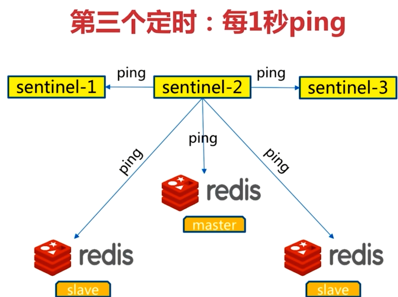
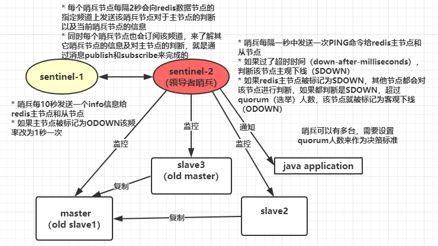

[TOC]


# 心得
+ 服务端高可用
+ 客户端高可用
+ Redis主从切换数据丢失？
# 概览
+ Sentinel进程是用于监控Redis集群中Master、Slave、Sentinel各成员
+ Sentinel是特殊的Redis，其默认端口26379
+ Master主服务器发生故障的时候，可以实现Master和Slave服务器的切换，保证系统的高可用
+ Sentinel当前最新的稳定版本称为Sentinel2(与之前的Sentinel 1区分开来）
+ 随着Redis2.8的安装包一起发行。安装完Redis2.8后，可以在Redis2.8/src/里面找到Redis-Sentinel的启动程序
+ **强烈建议：如果你使用的是Redis2.6(Sentinel版本为Sentinel 1)，你最好应该使用Redis2.8版本的Sentinel 2，因为Sentinel 1有很多的Bug，已经被官方弃用，所以强烈建议使用Redis2.8以及Sentinel2**
# 配置与持久化（纠正）
Snetinel的状态会被持久化地写入Sentinel的配置文件中。每次当收到一个新的配置时，或者新创建一个配置时，配置会被持久化到硬盘中，并带上配置的版本戳。这意味着，可以安全的停止和重启Sentinel进程。
## 发生failover后配置纠正
+ 一旦一个Sentinel成功地对一个Master进行了failover，它将会把关于Master的最新配置通过广播形式（pub/sub）通知其它Sentinel，其它的Sentinel则更新对应Master的配置
+ 一个faiover要想被成功实行，Sentinel必须能够向选为Master的Slave发送`SlaveOF NO ONE`命令，然后能够通过INFO命令看到新Master的配置信息。
+ 当将一个Slave选举为Master并发送`SlaveOF NO ONE`后，即使其它的Slave还没针对新Master重新配置自己，failover也被认为是成功了的，然后所有Sentinels将会发布新的配置信息。
+ 新配在集群中相互传播的方式，就是为什么我们需要当一个Sentinel进行failover时必须被授权一个版本号的原因。
+ 每个Sentinel使用【发布/订阅】的方式持续地传播Master的配置版本信息，配置传播的【发布/订阅】管道是：`__Sentinel__:hello`
+ 因为每一个配置都有一个版本号，所以以版本号最大的那个为标准。
## 无failover时的配置纠正
即使当前没有failover正在进行，Sentinel依然会使用当前配置去设置监控的Master。
+ 根据最新配置确认为Slaves的节点却声称自己是Master，这时它们会被重新配置为当前Master的Slave。
+ 如果Slaves连接了一个错误的Master，将会被改正过来，连接到正确的Master。
# Sentinel三大使命
## 监控（Monitoring）
Sentinel会不断检查Master和Slave是否运行正常
通过ping和info命令监控
## 提醒（Notification）
当被监控的某个Redis节点出现问题时， Sentinel可以通过api向管理员或者其他应用程序发送通知（调用脚本）
```config
Sentinel notification-script <Master-name> <script-path>
Sentinel notification-script myMaster /var/Redis/notify.sh
```
通知型脚本:
+ 当Sentinel有任何警告级别的事件发生时（**比如说Redis实例的主观失效和客观失效等等**），将会去调用这个脚本，这时这个脚本应该通过邮件，SMS等方式去通知系统管理员关于系统不正常运行的信息。
+ 调用该脚本时，将传给脚本两个参数，一个是事件的类型，一个是事件的描述
+ 如果Sentinel.conf配置文件中配置了这个脚本路径，那么必须保证这个脚本存在于这个路径，并且是可执行的，否则Sentinel无法正常启动成功

目前会存在该脚本被执行多次的问题，网上查找资料获得的解释是：
脚本分为两个级别：
+ Sentinel_LEADER：仅由领头 Sentinel 执行（一个 Sentinel）
+ Sentinel_OBSERVER：由监视同一个 Master 的所有 Sentinel 执行（多个 Sentinel）
## 自动故障转移（Automatic failover）
当Master不能正常操作时哨兵会开始一次故障转移
1. 它会将失效的Master的其中一个Slave升级为新的Master，并让其他Slave改为复制新的Master。<font color="red">(此时是全量复制？Redis4之后好像有骚操作)</font>
2. 当客户端试图连接失效的Master时，集群会向客户端显示新的Master的地址
3. Master和Slave切换后，Master的Redis.conf、Slave的reids.conf和seniSentinel的Sentinel.conf配置文件的内容都会相应的改变，即，Master主服务器的Redis.conf配置文件中会多一行Slaveof的配置，Sentinel.conf的监控目标会随之调换。


# 监控
## Sentinel三个定时任务
### 每10秒每个Sentinel对Master和Slave执行info
+ 发现Slave节点
+ 确认主从关系


### 每2秒每个Sentinel通过Master节点的channel（发布订阅的频道）交换信息（pub/sub）
+ 通过__Sentinel__:hello频道交互
+ 交互对节点的“看法”和自身信息


上图的原理就是:
订阅这个channel的所有Sentinel，一旦其中一个Sentinel发布消息到这个chennel其他订阅这个channel的Sentinel就会收到消息，它们就是这样传递消息
### 每1秒每个Sentinel对其他Sentinel和Redis执行ping
+ 心跳检查、失败判定依据

## Sentinel之间和Slaves之间的自动发现机制
虽然Sentinel集群中各个Sentinel都互相连接彼此来检查对方的可用性以及互相发送消息。<font color="red">但是你不用在任何一个Sentinel配置任何其它的Sentinel的节点</font>。因为Sentinel利用了Master的发布/订阅机制去自动发现其它也监控了统一Master的Sentinel节点。
+ 通过向名为`__Sentinel__:hello`的管道中发送消息来实现。
+ 同样，你也不需要在Sentinel中配置某个Master的所有Slave的地址，Sentinel会通过询问Master来得到这些Slave的地址的。
+ 每个Sentinel通过向每个Master和Slave的【发布/订阅】频道__Sentinel__:hello每秒发送一次消息，来宣布它的存在。
+ 每个Sentinel也订阅了每个Master和Slave的频道__Sentinel__:hello的内容，来发现未知的Sentinel，当检测到了新的Sentinel，则将其加入到自身维护的Master监控列表中。
+ 每个Sentinel发送的消息中也包含了其当前维护的最新的Master配置。如果某个Sentinel发现
+ 自己的配置版本低于接收到的配置版本，则会用新的配置更新自己的Master配置。
+ 在为一个Master添加一个新的Sentinel前，Sentinel总是检查是否已经有Sentinel与新的Sentinel的进程号或者是地址是一样的。如果是那样，这个Sentinel将会被删除，而把新的Sentinel添加上去。
## 举个例子
假设有一个名为myMaster的地址为192.168.10.202:6379。
一开始，集群中所有的Sentinel都知道这个地址，于是为myMaster的配置打上版本号1。
一段时候后myMaster死了，有一个Sentinel被授权用版本号2对其进行failover。
如果failover成功了，假设地址改为了192.168.10.202:9000，此时配置的版本号为2，进行failover的Sentinel会将新配置广播给其他的Sentinel，由于其他Sentinel维护的版本号为1，发现新配置的版本号为2时，版本号变大了，说明配置更新了，于是就会采用最新的版本号为2的配置。
这意味着Sentinel集群保证了第二种活跃性：一个能够互相通信的Sentinel集群最终会采用版本号最高且相同的配置。
# 提醒
## 发布与订阅信息（Sentinel的日志文件里可以看到这些信息）
客户端可以将Sentinel看作是一个只提供了订阅功能的Redis服务器：
你不可以使用PUBLISH命令向这个服务器发送信息， 但你可以用SUBSCRIBE命令或者PSUBSCRIBE命令， 通过订阅给定的频道来获取相应的事件提醒。
一个频道能够接收和这个频道的名字相同的事件。 比如说， 名为 +sdown 的频道就可以接收所有实例进入主观下线（SDOWN）状态的事件。
通过执行 "PSUBSCRIBE * "命令可以接收所有事件信息（即订阅所有消息）。
以下列出的是客户端可以通过订阅来获得的频道和信息的格式： 第一个英文单词是频道/事件的名字， 其余的是数据的格式。
注意， 当格式中包含 instance details 字样时， 表示频道所返回的信息中包含了以下用于识别目标实例的内容.

以下是所有可以收到的消息的消息格式，如果你订阅了所有消息的话。第一个单词是频道的名字，其它是数据的格式。
注意：以下的instance details的格式是：`<instance-type> <name> <ip> <port> @ <Master-name> <Master-ip> <Master-port>`
```
+reset-Master <instance details> -- 当Master被重置时.
+Slave <instance details> -- 当检测到一个Slave并添加进Slave列表时.
+failover-state-reconf-Slaves <instance details> -- Failover状态变为reconf-Slaves状态时
+failover-detected <instance details> -- 当failover发生时
+Slave-reconf-sent <instance details> -- Sentinel发送SlaveOF命令把它重新配置时
+Slave-reconf-inprog <instance details> -- Slave被重新配置为另外一个Master的Slave，但数据复制还未发生时。
+Slave-reconf-done <instance details> -- Slave被重新配置为另外一个Master的Slave并且数据复制已经与Master同步时。
-dup-Sentinel <instance details> -- 删除指定Master上的冗余Sentinel时 (当一个Sentinel重新启动时，可能会发生这个事件).
+Sentinel <instance details> -- 当Master增加了一个Sentinel时。
+sdown <instance details> -- 进入SDOWN状态时;
-sdown <instance details> -- 离开SDOWN状态时。
+odown <instance details> -- 进入ODOWN状态时。
-odown <instance details> -- 离开ODOWN状态时。
+new-epoch <instance details> -- 当前配置版本被更新时。
+try-failover <instance details> -- 达到failover条件，正等待其他Sentinel的选举。
+elected-leader <instance details> -- 被选举为去执行failover的时候。
+failover-state-select-Slave <instance details> -- 开始要选择一个Slave当选新Master时。
no-good-Slave <instance details> -- 没有合适的Slave来担当新Master
selected-Slave <instance details> -- 找到了一个适合的Slave来担当新Master
failover-state-send-Slaveof-noone <instance details> -- 当把选择为新Master的Slave的身份进行切换的时候。
failover-end-for-timeout <instance details> -- failover由于超时而失败时。
failover-end <instance details> -- failover成功完成时。
switch-Master <Master name> <oldip> <oldport> <newip> <newport> -- 当Master的地址发生变化时。通常这是客户端最感兴趣的消息了。
+tilt -- 进入Tilt模式。
-tilt -- 退出Tilt模式。
```

可以看出，使用Sentinel命令和发布订阅两种机制就能很好的实现和客户端的集成整合：
使用`get-Master-addr-by-name`和`Slaves`指令可以获取当前的Master和Slaves的地址和信息；而当发生故障转移时，即Master发生切换，可以通过订阅的+switch-Master事件获得最新的Master信息。
# 故障转移
1. 从Slave节点中选出一个“合适的”节点作为新的Master节点
2. 对上面的Slave节点执行Slaveof no one命令让其成为Master节点
3. 向剩余的Slave节点发送命令，让它们成为新Master节点的Slave节点，复制规则和parallel-syncs参数有关
4. 更新对原来Master节点配置为Slave，并保持对其“关注”，当其恢复后命令它去复制新的Master节点
## Sentinel故障判断流程
1. 每个Sentinel进程每秒钟一次的频率向整个集群中**Master**、**Slave**以及其它**Sentinel**进程发送一个`ping`命令<font color="red">【监听】</font>
2. 如果一个实例（instance）距离最后一次有效回复`ping`命令超过`down-after-milliseconds`选项所指定的值，这个实例会被Sentinel进程标记为**主观下线**<font color="red">【初步确认目标】</font>
3. 如果一个Master主服务器被标记为主观下线，则正在监视这个Master主服务器的所有Sentinel进程要以每秒一次的频率确认Master主服务器的确进入了主观下线状态<font color="red">【复查】</font>
4. 当有足够数量的Sentinel进程（大于等于配置文件指定的值）在指定的时间范围内确认Master主服务器进入了主观下线状态， 则Master主服务器会被标记为客观下线<font color="red">【定性】</font>
5. 在一般情况下， 每个Sentinel进程会以每10秒一次的频率向集群中的所有Master主服务器、Slave从服务器发送`info`命令<font color="red">【查询下线】</font>
6. 当Master主服务器被Sentinel进程标记为客观下线时，Sentinel进程向下线的Master主服务器的所有Slave从服务器发送`info`命令的频率会从10秒一次改为每秒一次【一个faiover要想被成功实行，Sentinel必须能够向选为Master的Slave发送`SlaveOF NO ONE`命令，然后能够通过INFO命令看到新Master的配置信息】
7. 若没有足够数量的Sentinel进程同意Master已经下线， Master主服务器的客观下线状态就会被移除。若Master主服务器重新向Sentinel进程发送 `ping`命令返回有效回复，Master主服务器的主观下线状态就会被移除【变成Slave？】

## 主观下线（sdown）和客观下线（odown）
```config
Sentinel monitor <MasterName> <ip> <port> <quorum>
Sentinel monitor myMaster 127.0.0.1 6379 2
```
四个参数：<font color="red">多个哨兵是如何发现彼此的</font>
+ MasterName这个是对某个Master+Slave组合的一个区分标识（一套Sentinel是可以监听多套Master+Slave这样的组合的）【Sentinel的配置是会动态变化的】
+ ip和port就是Master节点的ip和端口号。
+ quorum这个参数是进行客观下线的一个依据，意思是至少有quorum个Sentinel主观的认为这个Master有故障，才会对这个Master进行下线以及故障转移。因为有的时候，某个Sentinel节点可能因为自身网络原因，导致无法连接Master，而此时Master并没有出现故障，所以这就需要多个Sentinel都一致认为该Master有问题，才可以进行下一步操作，这就保证了公平性和高可用。
```config
Sentinel down-after-milliseconds <MasterName> <timeout>
Sentinel down-after-milliseconds myMaster 30000
```
这个配置其实就是进行主观下线的一个依据，MasterName这个参数不用说了，timeout是一个毫秒值，表示：如果这台Sentinel超过timeout这个时间都无法连通Master包括Slave（<font color="red">Slave不需要客观下线，因为不需要故障转移</font>）的话，就会主观认为该Master已经下线（实际下线需要客观下线的判断通过才会下线）

那么，多个Sentinel之间是如何达到共识的呢？
这就是依赖于前面说的第二个定时任务，某个Sentinel先将Master节点进行一个主观下线，然后会将这个判定通过`Sentinel is-Master-down-by-addr`这个命令问对应的节点是否也同样认为该addr的Master节点要做客观下线。

最后当达成这一共识的Sentinel个数达到前面说的quorum设置的这个值时，就会对该Master节点下线进行故障转移。
quorum的值一般设置为Sentinel个数的二分之一加1，例如3个Sentinel就设置2。
<font color="red">rac算法</font>
## 主观下线（Subjectively Down， 简称 SDOWN）：每个Sentinel节点对Redis节点失败的“偏见”
+ 所谓主观下线，指的是单个Sentinel实例对服务器做出的下线判断，即单个Sentinel认为某个服务下线（有可能是接收不到订阅，网络不通等等原因）。
+ 主观下线就是说如果服务器在`down-after-milliseconds`给定的毫秒数之内， 没有返回Sentinel发送的`ping`命令的回复， 或者返回一个错误， 那么 Sentinel将这个服务器标记为主观下线。
+ Sentinel会以每秒一次的频率向所有与其建立了命令连接的实例（Master，从服务，其他Sentinel）发`ping`命令，通过判断ping回复是有效回复，还是无效回复来判断实例时候在线（对该Sentinel来说是“主观在线”）。
+ Sentinel配置文件中的`down-after-milliseconds`设置了判断主观下线的时间长度，如果实例在`down-after-milliseconds`毫秒内，返回的都是无效回复，那么Sentinel回认为该实例已（主观）下线，修改其flags状态为SRI_S_DOWN。如果多个Sentinel监视一个服务，有可能存在多个Sentinel的`down-after-milliseconds`配置不同，这个在实际生产中要注意。
## 客观下线（Objectively Down， 简称 ODOWN）：所有Sentinel节点对Redis节点失败“达成共识”（超过quorum个统一）
+ 客观下线，指的是多个Sentinel实例在对同一个服务器做出SDOWN判断， 并且通过`Sentinel is-Master-down-by-addr`命令互相交流之后， 得出的服务器下线判断，然后开启failover。
+ 客观下线就是说只有在足够数量的Sentinel都将一个服务器标记为主观下线之后， 服务器才会被标记为客观下线（ODOWN）。
+ 只有当Master被认定为客观下线时，**才会发生故障迁移**。
+ 当Sentinel监视的某个服务主观下线后，Sentinel会询问其它监视该服务的Sentinel，看它们是否也认为该服务主观下线，接收到足够数量（这个值可以配置：quorum）的Sentinel判断为主观下线，既任务该服务客观下线，并对其做故障转移操作。
+ Sentinel通过发送`Sentinel is-Master-down-by-addr ip port current_epoch runid`，（ip：主观下线的服务id，port：主观下线的服务端口，current_epoch：Sentinel的纪元，runid：*表示检测服务下线状态，如果是Sentinel 运行id，表示用来选举领头Sentinel）来询问其它Sentinel是否同意服务下线。
+ 一个Sentinel接收另一个Sentinel发来的`is-Master-down-by-addr`后，提取参数，根据ip和端口，检测该服务时候在该Sentinel主观下线，并且回复`is-Master-down-by-addr`，回复包含三个参数：down_state（1表示已下线，0表示未下线），leader_runid（领头sentinal id），leader_epoch（领头Sentinel纪元）。
+ Sentinel接收到回复后，根据配置设置的下线最小数量，达到这个值，既认为该服务客观下线。
+ 客观下线条件只适用于主服务器： 对于任何其他类型的Redis 实例，Sentinel 在将它们判断为下线前不需要进行协商， 所以从服务器或者其他Sentinel永远不会达到客观下线条件。只要一个Sentinel 发现某个主服务器进入了客观下线状态， 这个Sentinel 就可能会被其他Sentinel 推选出， 并对失效的主服务器执行自动故障迁移操作。
## 主观下线（SDOWN）和客观下线（ODOWN）的更多细节
Sentinel对于不可用有两种不同的看法：
+ 主观不可用(SDOWN)
+ 客观不可用(ODOWN)

SDOWN是Sentinel自己主观上检测到的关于Master的状态，ODOWN需要一定数量的Sentinel达成一致意见才能认为一个Master客观上已经宕掉，各个Sentinel之间通过命令`Sentinel is_Master_down_by_addr`来获得其它Sentinel对Master的检测结果。

从Sentinel的角度来看，如果发送了ping心跳后，在一定时间内没有收到合法的回复，就达到了SDOWN的条件。这个时间在配置中通过`is-Master-down-after-milliseconds`参数配置。
当Sentinel发送PING后，以下回复之一都被认为是合法的：
```
1）PING replied with +PONG.
2）PING replied with -LOADING error.
3）PING replied with -MasterDOWN error.
```
其它任何回复（或者根本没有回复）都是不合法的。

从SDOWN切换到ODOWN不需要任何一致性算法，只需要一个<font color="red">gossip协议</font>：如果一个Sentinel收到了足够多的Sentinel发来消息告诉它某个Master已经down掉了，SDOWN状态就会变成ODOWN状态。如果之后Master可用了，这个状态就会相应地被清理掉。
正如之前已经解释过了，真正进行failover需要一个授权的过程，但是所有的failover都开始于一个ODOWN状态。
<font color="red">ODOWN状态只适用于Master，对于不是Master的Redis节点Sentinel之间不需要任何协商，Slaves和Sentinel不会有ODOWN状态。</font>

<font color="red">如果Slave与Sentinel全部都战损了呢？？？</font>
## SDOWN与ODOWN转换过程
1. 每个Sentinel实例在启动后，都会和已知的Slaves/Master以及其他Sentinels建立TCP连接，并周期性发送PING(默认为1秒)
2. 在交互中，如果Redis-server无法在`down-after-milliseconds`时间内响应或者响应错误信息，都会被认为此Redis-server处于SDOWN状态。
2. 如果SDOWN的server为Master，那么此时Sentinel实例将会向其他Sentinel间歇性(一秒)发送`is-Master-down-by-addr <ip> <port>`指令并获取响应信息，如果足够多的Sentinel实例检测到Master处于SDOWN，那么此时当前Sentinel实例标记Master为ODOWN...其他Sentinel实例做同样的交互操作。
3. 配置项`Sentinel monitor <Mastername> <Masterip> <Masterport> <quorum>`，如果检测到Master处于SDOWN状态的Slave个数达到`<quorum>`，那么此时此Sentinel实例将会认为Master处于ODOWN。每个Sentinel实例将会间歇性(10秒)向Master和Slaves发送`INFO`指令，如果Master失效且没有新Master选出时，每1秒发送一次`INFO`；`INFO`的主要目的就是获取并确认当前集群环境中Slaves和Master的存活情况。
4. 经过上述过程后，所有的Sentinel对Master失效达成一致后，开始failover.

## 选择“合适的”Slave节点
1. 选择Slave-priority（Slave节点优先级）最高的Slave节点，如果存在则返回，不存在则继续
2. 选择复制偏移量最大的Slave节点（复制的最完整），如果存在则返回，不存在则继续
3. 选择runId最小的Slave节点

Slave的选举主要会评估Slave的以下几个方面：
1. 与Master断开连接的次数
2. Slave的优先级
3. 数据复制的下标(用来评估Slave当前拥有多少Master的数据)
4. runid

如果一个Slave与Master失去联系超过10次，并且每次都超过了配置的最大失联时间(down-after-milliseconds)，如果Sentinel在进行failover时发现Slave失联，那么这个Slave就会被Sentinel认为不适合用来做新Master的。
更严格的定义是，如果一个Slave持续断开连接的时间超过
(down-after-milliseconds * 10) + milliseconds_since_Master_is_in_SDOWN_state
就会被认为失去选举资格。

符合上述条件的Slave才会被列入Master候选人列表，并根据以下顺序来进行排序：
1. Sentinel首先会根据Slaves的优先级来进行排序，优先级越小排名越靠前。
2. 如果优先级相同，则查看复制的下标，哪个从Master接收的复制数据多，哪个就靠前。
3. 如果优先级和下标都相同，就选择进程ID较小的那个。

一个Redis无论是Master还是Slave，都必须在配置中指定一个Slave优先级。要注意到Master也是有可能通过failover变成Slave的。
如果一个Redis的Slave优先级配置为0，那么它将永远不会被选为Master。但是它依然会从Master哪里复制数据。


## Redis Sentinel 主从切换(failover)的容灾环境部署记录
Redis主从复制简单来说：
A）Redis的复制功能是支持多个数据库之间的数据同步。一类是主数据库（Master）一类是从数据库（Slave），主数据库可以进行读写操作，当发生写操作的时候自动将数据同步到从数据库，而从数据库一般是只读的，并接收主数据库同步过来的数据，一个主数据库可以有多个从数据库，而一个从数据库只能有一个主数据库。
B）通过Redis的复制功能可以很好的实现数据库的读写分离，提高服务器的负载能力。主数据库主要进行写操作，而从数据库负责读操作。

Redis主从复制流程简图

Redis主从复制的大致过程：
1）当一个从数据库启动时，会向主数据库发送sync命令，
2）主数据库接收到sync命令后会开始在后台保存快照（执行rdb操作），并将保存期间接收到的命令缓存起来
3）当快照完成后，Redis会将快照文件和所有缓存的命令发送给从数据库。
4）从数据库收到后，会载入快照文件并执行收到的缓存的命令。

注意：Redis2.8之前的版本：当主从数据库同步的时候从数据库因为网络原因断开重连后会重新执行上述操作，不支持断点续传。Redis2.8之后支持断点续传。

0）Redis主从结构支持一主多从+n个Sentinel模式，信息如下：
```
192.168.10.202   Redis-Master    Redis（6379）、Sentinel（26379）
192.168.10.203   Redis-Slave01   Redis（6379）、Sentinel（26379）
192.168.10.205   Redis-Slave02   Redis（6379）、Sentinel（26379） 
  
关闭三个节点机器的iptables和selinux（所有节点机器上都要操作）
[root@Redis-Master ~]# /etc/init.d/iptables stop
[root@Redis-Master ~]# vim /etc/sysconfig/selinux
......
SELINUX=disabled
[root@Redis-Master ~]# setenforce 0
[root@Redis-Master ~]# getenforce
Permissive
  
注意：本案例采用1主2从+3 Sentinel的集群模式，所有从节点的配置都一样。
```
a）Redis服务器上各自存在一个Sentinel，监控本机Redis的运行情况，并通知给闭路环上其它的Redis节点；
b）当Master发生异常（例如：宕机和断电等）导致不可运行时，Sentinel将通知给其它节点，而剩余节点上的Sentinel将重新选举出新的Master，而原来的Master重新恢复正常后，则一直扮演Slave角色；
c）规定整个架构体系中，Master提供读写服务，而Slave只提供读取服务。
## failover过程
在Leader触发failover之前，首先wait数秒(随即0~5)，以便让其他Sentinel实例准备和调整(有可能多个leader)，如果一切正常，那么leader就需要开始将一个Slave提升为Master，此Slave必须为状态良好(不能处于SDOWN/ODOWN状态)且权重值最低(Redis.conf中)的，当Master身份被确认后，开始failover
1. `+failover-triggered`: Leader开始进行failover，此后紧跟着`+failover-state-wait-start`，wait数秒。
2. `+failover-state-select-Slave`: Leader开始查找合适的Slave
3. `+selected-Slave`: 已经找到合适的Slave
4. `+failover-state-sen-Slaveof-noone`: Leader向Slave发送`Slaveof no one`指令，此时Slave已经完成角色转换，此Slave即为Master
5. `+failover-state-wait-promotition`: 等待其他Sentinel确认Slave
6. `+promoted-Slave`：确认成功
7. `+failover-state-reconf-Slaves`: 开始对Slaves进行reconfig操作。
8. `+Slave-reconf-sent`:向指定的Slave发送`Slaveof`指令，告知此Slave跟随新的Master
9. `+Slave-reconf-inprog`: 此Slave正在执行Slaveof + SYNC过程，如过Slave收到`+Slave-reconf-sent`之后将会执行Slaveof操作。
10. `+Slave-reconf-done`: 此Slave同步完成，此后leader可以继续下一个Slave的reconfig操作。循环G）
11. `+failover-end`: 故障转移结束
12. `+switch-Master`：故障转移成功后，各个Sentinel实例开始监控新的Master。


# 总结
+ Redis Sentinel是Redis的高可用实现方案：故障发现、故障自动转移、配置中心、客户端通知
+ Redis Sentinel从2.8版本开始才正式生产可用，之前版本生产不可用
+ 尽可能在不同物理机上部署Redis Sentinel所有节点
+ Redis Sentinel中的Sentinel节点个数应该为大于等于3且最好为奇数
+ Redis Sentinel中的数据节点与普通数据节点没有区别
+ 客户端初始化时连接的是Sentinel节点集合，不再是具体的Redis节点，但Sentinel只是配置中心不是代理
+ Redis Sentinel通过三个定时任务实现了Sentinel节点对于主节点、从节点、其余Sentinel节点的监控
+ Redis Sentinel在对节点做失败判定时分为主观下线和客观下线
+ 看懂Redis Sentinel故障转移日志对于Redis Sentinel以及问题排查非常有帮助
+ Redis Sentinel实现读写分离高可用可以依赖Sentinel节点的消息通知，获取Redis数据节点的状态变化
