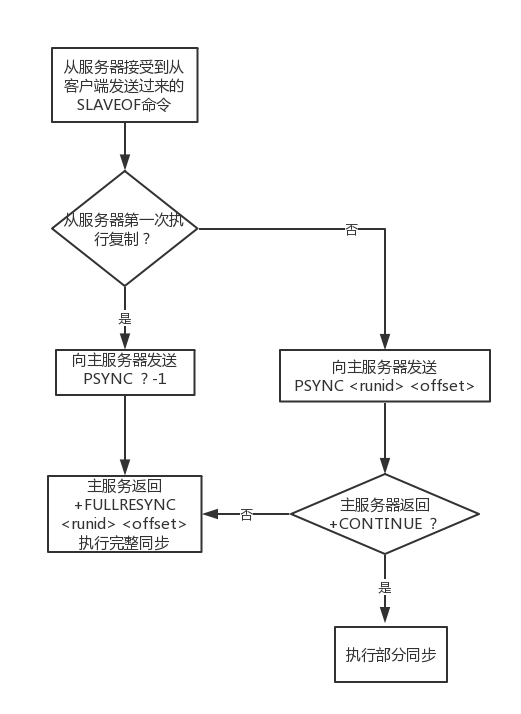
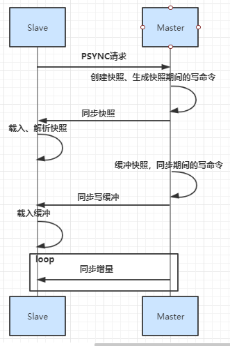
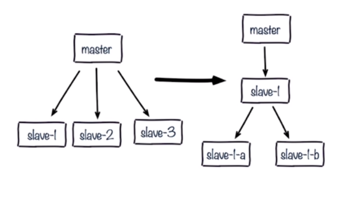

[TOC]

redis2.8之前都是全量复制

# 用到的命令
```
info replication
flushall
```
# 单节点redis风险
+ 机器故障
+ 容量瓶颈
+ QPS瓶颈
# master&&slave概览
1. 一个master可以有多个slave
2. 一个slave只能有一个master
3. 数据流向是单向的，master到slave
# 角色

+ Redis主从复制主要有两个角色，**主机（master）对外提供读写功能**，**从机（slave）对外只提供读功能**，主机定期把数据同步到从机上保证数据一致性。
+ Redis主机数据同步到从机上有两种方式，一种是全量同步(没得runid)，另一种是增量同步。
+ 主从复制不会阻塞master（fork方式），在数据同步时，master还可以继续处理客户端请求，因为redis会产生一个新的进程来解决同步问题。
一个redis也可以是从也可以是主（树状主从），可以减轻主机压力。


# 配置
只需要修改从服务器上的redis.conf文件：
```config
# slaveof <masterip> <masterport>
# 表示当前【从服务器】对应的【主服务器】的IP是192.168.10.135，端口是6379。
slaveof 192.168.10.135 6379
#我们希望从节点只做读的操作，不希望写入，如果写入会造成主从数据不一致
slave-read-only yes
```
启动主服务器
```
redis-server redis.conf
```
启动从服务器
```
# 查看主服务器信息，可以看到有几个从服务器
redis-cli -p 6379 info Replication
```
# 实现原理
+ redis的主从同步分为两种，分为<font color="red">**全量同步**</font>和<font color="red">**增量同步**</font>。
+ <font color="red">**只有从机第一次连接上主机是全量同步**</font>。
+ 断线重连很有可能触发全量同步也有可能是增量同步<font color="red">**（master判断runid是否一致）**</font>。

# runid
+ Redis服务器的随机标识符（用于 Sentinel 和集群），重启后就会改变。
+ 每个redis服务器，不论主服务器还是从服务，都会有自己的运行id。`PSYNC runid`这个命令，runid是指上一次复制主服务器的运行id，如果没有保存这个id，PSYNC的命令会使用”PSYNC ? -1” 这种形式发送给Master，请求主服务器进行全量复制。
# offset（复制偏移量）
主服务器和从服务器会分别维护一个复制偏移量，主服务器每次向从服务器传播N个字节的数据时，就将自己的复制偏移量的值加上N，从服务器每次收到主服务器传播来的N个字节的数据时，就将自己的复制偏移量值加上N。

# 复制积压缓冲区（同步断线处理）
**复制积压缓冲区是由主服务器维护一个固定长度（fixed-size）先进先出（FIFO）队列，默认大小是1MB。**
它主要的作用就是当主服务器进行命令传播时，不仅将命令发送给所有从服务器，还会将命令入队到复制积压缓冲区。
如果主服务器向从服务器传播数据时发生断线，主服务器会将复制积压缓冲区偏移量的所有数据都发送给从服务器（发送的是断线之后的的数据）。

# 如果主从节点偏移量不同可能为
+ 网络
+ 阻塞
+ 缓存区出现问题
# PSYNC执行过程
1. Slave接受从客户端发送过来的slaveof命令。
2. 当前服务器判断自己是否保存Master runid<font color="red">**（是否是第一次复制）**</font>。
3. 如果是第一次复制那么当前服务器向Master发送PSYNC ？ -1命令，主动请求Master进行全量同步。
4. 如果已经父之过Master，那么当前从服务器向Master发送PSYNC runid offset命令。
5. Master接收到PSYNC 命令后首先判断runid是否和本机的id一致，如果runid和本机id不一致则返回+FULLRESYNC runid offset命令执行全量同步操作，当前服务器会将runid保存起来，在下次发送PSUNC时使用。
6. 如果判断runid和本机id一致，Master则会再次判断offset偏移量和本机的偏移量相差有没有超过复制积压缓冲区大小，如果没有那么就给Slave发送CONTINUE，此时Slave只需要等待Master传回失去连接期间丢失的命令；
# 全量同步
Redis的全量同步主要分为三个阶段：
+ 同步快照阶段：Master创建并发送快照给Slave，Slave再入快照并解析。Master同时将此阶段产生的新的命令写入到积压缓冲区中。
+ 同步写缓冲阶段：Master向Slave同步存储在缓冲区的写操作命令。
+ 同步增量阶段：Master向SLave同步写操作命令。



# redis主从复制流程图

# redis修改配置两种方式
| 方式 |    命令    |   配置   |
| ---- | ---------- | -------- |
| 优点 | 不需重启   | 统一配置 |
| 缺点 | 不便于管理 | 需要重启 |
# 查看偏移量
命令：
```redis
redis>info replication
role:master
connected_slaves:0
master_replid:711710915ff934f4b00e2a5143da342b5df4340f
master_replid2:0000000000000000000000000000000000000000
master_repl_offset:0    #偏移量
second_repl_offset:-1
repl_backlog_active:0
repl_backlog_size:1048576
repl_backlog_first_byte_offset:0
repl_backlog_histlen:0
```
# 全量复制开销
1. bgsave时间
2. RDB文件网络传输时间
3. 从节点清空数据时间
4. 从节点加载RDB时间
5. 可能的AOF重写时间
# 主从复制开发与运维中的问题
1. 读写分离
2. 主从配置不一致
3. 规避全量复制
4. 规避复制风暴
## 读写分离
读写分离：读流量分摊到从节点

可能遇到的问题：
+ 复制数据延迟（主从不一致）
+ 读到过期数据（master节点惰性删除。slave不能删除数据，可能读到脏数据。redis3.2已经解决了这样问题）
+ 从节点故障
## 配置不一致
1. 例如maxmemory不一致：丢失数据
2. 例如数据结构优化参数（例如hash-max-ziplist-entries在主节点做了优化，从节点没有优化）：内存不一致
## 规避全量复制
1.第一次全量复制（第一次不可避免）
优化：小主节点（maxmemory不要设置过大）、低峰
2.节点运行id不匹配
（1）主节点发生重启（运行id变化）redis4.0 PSYNC2 可处理
（2）故障转移，例如哨兵或集群
3.复制积压缓冲区不足（默认值1m）网络抖动？
网络中断，部分复制无法满足
增大复制缓冲区配置rel_backlog_size，网络”增强“
## 规避复制风暴
1.单节点复制风暴
问题：主节点重启，多从节点复制
解决：更换复制拓扑

如果slave1出了问题，如何解决？
树型结构、酒店式结构

2.单机器复制风暴
如下图：机器宕机后，大量全量复制


---
## Redis Sentinel 主从切换(failover)的容灾环境部署记录
Redis主从复制简单来说：
A）Redis的复制功能是支持多个数据库之间的数据同步。一类是主数据库（Master）一类是从数据库（Slave），主数据库可以进行读写操作，当发生写操作的时候自动将数据同步到从数据库，而从数据库一般是只读的，并接收主数据库同步过来的数据，一个主数据库可以有多个从数据库，而一个从数据库只能有一个主数据库。
B）通过Redis的复制功能可以很好的实现数据库的读写分离，提高服务器的负载能力。主数据库主要进行写操作，而从数据库负责读操作。
Redis主从复制的大致过程：
1）当一个从数据库启动时，会向主数据库发送sync命令，
2）主数据库接收到sync命令后会开始在后台保存快照（执行rdb操作），并将保存期间接收到的命令缓存起来
3）当快照完成后，Redis会将快照文件和所有缓存的命令发送给从数据库。
4）从数据库收到后，会载入快照文件并执行收到的缓存的命令。

注意：Redis2.8之前的版本：当主从数据库同步的时候从数据库因为网络原因断开重连后会重新执行上述操作，不支持断点续传。Redis2.8之后支持断点续传。

0）Redis主从结构支持一主多从+n个Sentinel模式，信息如下：
```
192.168.10.202   Redis-Master    Redis（6379）、Sentinel（26379）
192.168.10.203   Redis-Slave01   Redis（6379）、Sentinel（26379）
192.168.10.205   Redis-Slave02   Redis（6379）、Sentinel（26379） 
  
关闭三个节点机器的iptables和selinux（所有节点机器上都要操作）
[root@Redis-Master ~]# /etc/init.d/iptables stop
[root@Redis-Master ~]# vim /etc/sysconfig/selinux
......
SELINUX=disabled
[root@Redis-Master ~]# setenforce 0
[root@Redis-Master ~]# getenforce
Permissive
  
注意：本案例采用1主2从+3 Sentinel的集群模式，所有从节点的配置都一样。
```
a）Redis服务器上各自存在一个Sentinel，监控本机Redis的运行情况，并通知给闭路环上其它的Redis节点；
b）当Master发生异常（例如：宕机和断电等）导致不可运行时，Sentinel将通知给其它节点，而剩余节点上的Sentinel将重新选举出新的Master，而原来的Master重新恢复正常后，则一直扮演Slave角色；
c）规定整个架构体系中，Master提供读写服务，而Slave只提供读取服务。