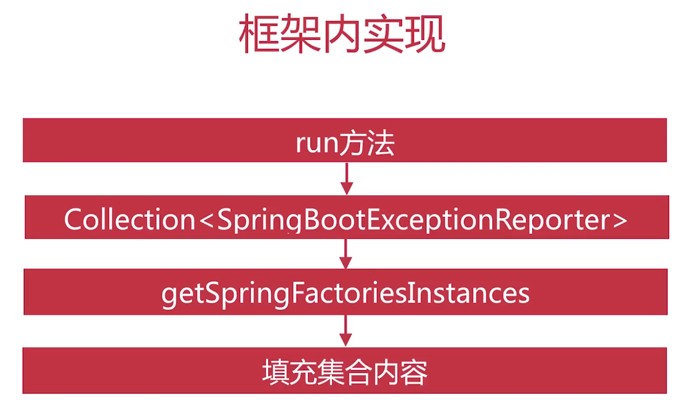
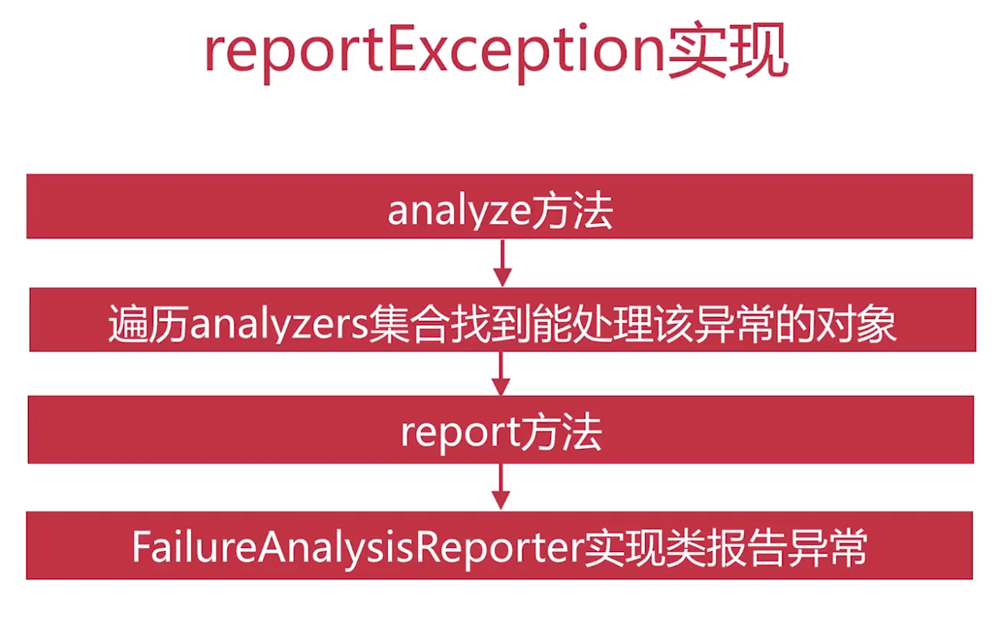
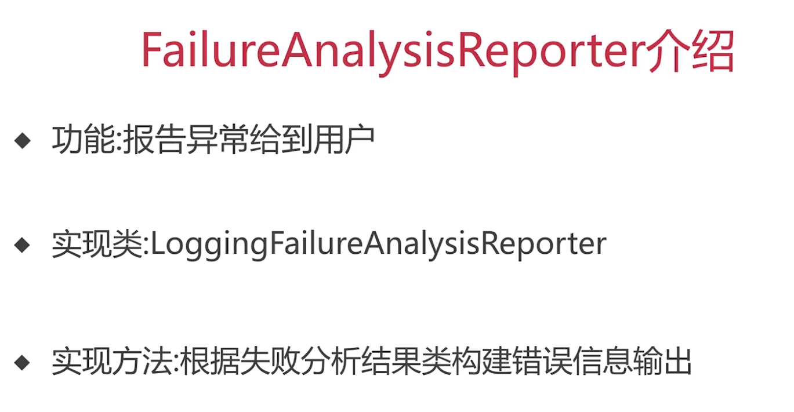

[TOC]

SpringBootExceptionReporter
FailureAnalyzers
FailureAnalyzer
AbstractFailureAnalyzers
FailureAnalysisReporter
LoggingFailureAnalysisReporter

# 概览
+ 只有一个异常报告器：FailureAnalyzers
+ 它的作用是将异常分发给对相对异常感兴趣(通过泛型)的异常分析器(FailureAnalyzer)


# 接口规范
SpringBootExceptionReporter
```java
@FunctionalInterface
public interface SpringBootExceptionReporter {

	/**
	 * Report a startup failure to the user.
	 * @param failure the source failure
	 * @return {@code true} if the failure was reported or {@code false} if default
	 * reporting should occur.
	 */
	boolean reportException(Throwable failure);

}
```


# 流程
## spring.factories配置
### Error Reporters
```
# Error Reporters
org.springframework.boot.SpringBootExceptionReporter=\
org.springframework.boot.diagnostics.FailureAnalyzers
```
### Failure Analyzers
```
# Failure Analyzers
org.springframework.boot.diagnostics.FailureAnalyzer=\
org.springframework.boot.diagnostics.analyzer.BeanCurrentlyInCreationFailureAnalyzer,\
org.springframework.boot.diagnostics.analyzer.BeanDefinitionOverrideFailureAnalyzer,\
org.springframework.boot.diagnostics.analyzer.BeanNotOfRequiredTypeFailureAnalyzer,\
org.springframework.boot.diagnostics.analyzer.BindFailureAnalyzer,\
org.springframework.boot.diagnostics.analyzer.BindValidationFailureAnalyzer,\
org.springframework.boot.diagnostics.analyzer.UnboundConfigurationPropertyFailureAnalyzer,\
org.springframework.boot.diagnostics.analyzer.ConnectorStartFailureAnalyzer,\
org.springframework.boot.diagnostics.analyzer.NoSuchMethodFailureAnalyzer,\
org.springframework.boot.diagnostics.analyzer.NoUniqueBeanDefinitionFailureAnalyzer,\
org.springframework.boot.diagnostics.analyzer.PortInUseFailureAnalyzer,\
org.springframework.boot.diagnostics.analyzer.ValidationExceptionFailureAnalyzer,\
org.springframework.boot.diagnostics.analyzer.InvalidConfigurationPropertyNameFailureAnalyzer,\
org.springframework.boot.diagnostics.analyzer.InvalidConfigurationPropertyValueFailureAnalyzer
```
## 初始化与触发
```java
public ConfigurableApplicationContext run(String... args) {
    ......
	Collection<SpringBootExceptionReporter> exceptionReporters = new ArrayList<>();
    ......
	try {
        ......
        // 加载spring.factories中的reporter
		exceptionReporters = getSpringFactoriesInstances(SpringBootExceptionReporter.class,
				new Class[] { ConfigurableApplicationContext.class }, context);
        ......
	}
	catch (Throwable ex) {
		handleRunFailure(context, ex, exceptionReporters, listeners);
		throw new IllegalStateException(ex);
	}

	try {
		listeners.running(context);
	}
	catch (Throwable ex) {
		handleRunFailure(context, ex, exceptionReporters, null);
		throw new IllegalStateException(ex);
	}
	return context;
}

private void handleRunFailure(ConfigurableApplicationContext context, Throwable exception,
		Collection<SpringBootExceptionReporter> exceptionReporters, SpringApplicationRunListeners listeners) {
	try {
		try {
			handleExitCode(context, exception);
			if (listeners != null) {
				listeners.failed(context, exception);
			}
		}
		finally {
			reportFailure(exceptionReporters, exception);
			if (context != null) {
				context.close();
			}
		}
	}
	catch (Exception ex) {
		logger.warn("Unable to close ApplicationContext", ex);
	}
	ReflectionUtils.rethrowRuntimeException(exception);
}

private void handleExitCode(ConfigurableApplicationContext context, Throwable exception) {
	int exitCode = getExitCodeFromException(context, exception);
	if (exitCode != 0) {
		if (context != null) {
			context.publishEvent(new ExitCodeEvent(context, exitCode));
		}
		SpringBootExceptionHandler handler = getSpringBootExceptionHandler();
		if (handler != null) {
			handler.registerExitCode(exitCode);
		}
	}
}
```
## 唯一的一个ExceptionReporter:FailureAnalyzers.java
```java
final class FailureAnalyzers implements SpringBootExceptionReporter {

	private static final Log logger = LogFactory.getLog(FailureAnalyzers.class);

    // 外部传进来一个类加载器
	private final ClassLoader classLoader;

    // 容器
	private final List<FailureAnalyzer> analyzers;

	FailureAnalyzers(ConfigurableApplicationContext context) {
		this(context, null);
	}

	FailureAnalyzers(ConfigurableApplicationContext context, ClassLoader classLoader) {
	    // 断言容器是否存在
		Assert.notNull(context, "Context must not be null");
		// 设置类加载器
		this.classLoader = (classLoader != null) ? classLoader : context.getClassLoader();
		// 初始化异常分析者
		this.analyzers = loadFailureAnalyzers(this.classLoader);
		// 这步我不懂了？？？
		prepareFailureAnalyzers(this.analyzers, context);
	}

    // 加载Failure Analyzers（工厂配置）
	private List<FailureAnalyzer> loadFailureAnalyzers(ClassLoader classLoader) {
		List<String> analyzerNames = SpringFactoriesLoader.loadFactoryNames(FailureAnalyzer.class, classLoader);
		List<FailureAnalyzer> analyzers = new ArrayList<>();
		for (String analyzerName : analyzerNames) {
			try {
			    // 反射生成可访问的对象
				Constructor<?> constructor = ClassUtils.forName(analyzerName, classLoader).getDeclaredConstructor();
				ReflectionUtils.makeAccessible(constructor);
				analyzers.add((FailureAnalyzer) constructor.newInstance());
			}
			catch (Throwable ex) {
				logger.trace(LogMessage.format("Failed to load %s", analyzerName), ex);
			}
		}
		AnnotationAwareOrderComparator.sort(analyzers);
		return analyzers;
	}

	private void prepareFailureAnalyzers(List<FailureAnalyzer> analyzers, ConfigurableApplicationContext context) {
		for (FailureAnalyzer analyzer : analyzers) {
			prepareAnalyzer(context, analyzer);
		}
	}

	private void prepareAnalyzer(ConfigurableApplicationContext context, FailureAnalyzer analyzer) {
		if (analyzer instanceof BeanFactoryAware) {
			((BeanFactoryAware) analyzer).setBeanFactory(context.getBeanFactory());
		}
		if (analyzer instanceof EnvironmentAware) {
			((EnvironmentAware) analyzer).setEnvironment(context.getEnvironment());
		}
	}

    /**
    * 触发异常还是靠循环
    */
	@Override
	public boolean reportException(Throwable failure) {
		FailureAnalysis analysis = analyze(failure, this.analyzers);
		return report(analysis, this.classLoader);
	}

	private FailureAnalysis analyze(Throwable failure, List<FailureAnalyzer> analyzers) {
		for (FailureAnalyzer analyzer : analyzers) {
			try {
				FailureAnalysis analysis = analyzer.analyze(failure);
				if (analysis != null) {
					return analysis;
				}
			}
			catch (Throwable ex) {
				logger.debug(LogMessage.format("FailureAnalyzer %s failed", analyzer), ex);
			}
		}
		return null;
	}

	private boolean report(FailureAnalysis analysis, ClassLoader classLoader) {
		List<FailureAnalysisReporter> reporters = SpringFactoriesLoader.loadFactories(FailureAnalysisReporter.class,
				classLoader);
		if (analysis == null || reporters.isEmpty()) {
			return false;
		}
		for (FailureAnalysisReporter reporter : reporters) {
			reporter.report(analysis);
		}
		return true;
	}

}
```
## Analyzer的实现
+ FlywayMigrationScriptMissingFailureAnalyzer
+ InvalidConfigurationPropertyNameFailureAnalyzer
+ BindFailureAnalyzer
+ DataSourceBeanCreationFailureAnalyzer
+ BindValidationFailureAnalyzer
+ ValidationExceptionFailureAnalyzer
+ BeanDefinitionOverrideFailureAnalyzer
+ NoSuchMethodFailureAnalyzer
+ AbstractInjectionFailureAnalyzer (NoSuchBeanDefinitionFailureAnalyzer,NoSuchBeanDefinitionFailureAnalyzer)
+ NonUniqueSessionRepositoryFailureAnalyzer
+ ConnectorStartFailureAnalyzer
+ InvalidConfigurationPropertyValueFailureAnalyzer
+ BeanNotOfRequiredTypeFailureAnalyzer
+ HikariDriverConfigurationFailureAnalyzer
+ PortInUseFailureAnalyzer
+ BeanCurrentlyInCreationFailureAnalyzer
+ UnboundConfigurationPropertyFailureAnalyzer

# 框架内实现




