[TOC]

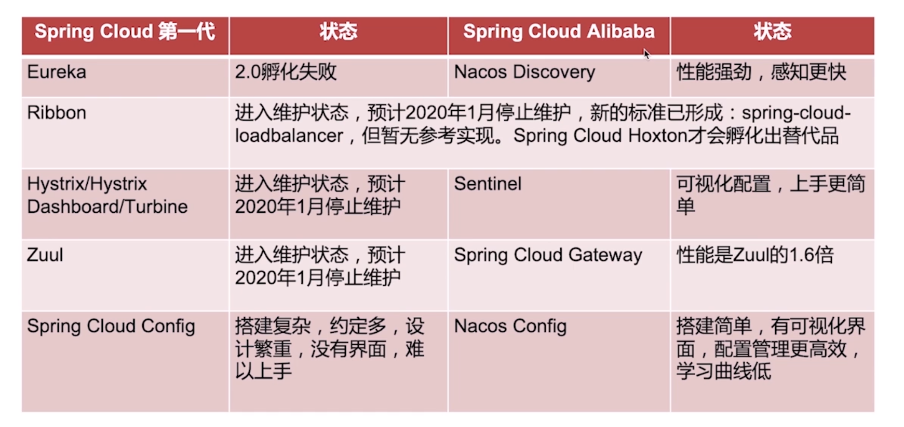

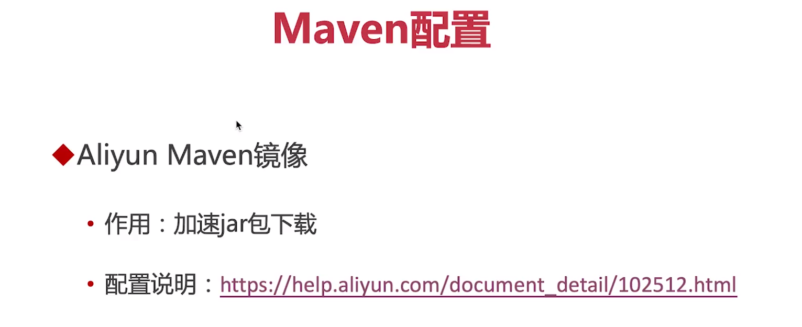

maven/conf/settings.xml
mirrors
```
<mirror>
<id>aliyunmaven</id>
<mirrorOf>*是全部jar包都从镜像下载，central是核心</mirrorOf>
<name>阿里云公共仓库</name>
<url>https://maven.aliyun.com/。。。。。。。</url>
</mirror>
```

# SpringBoot
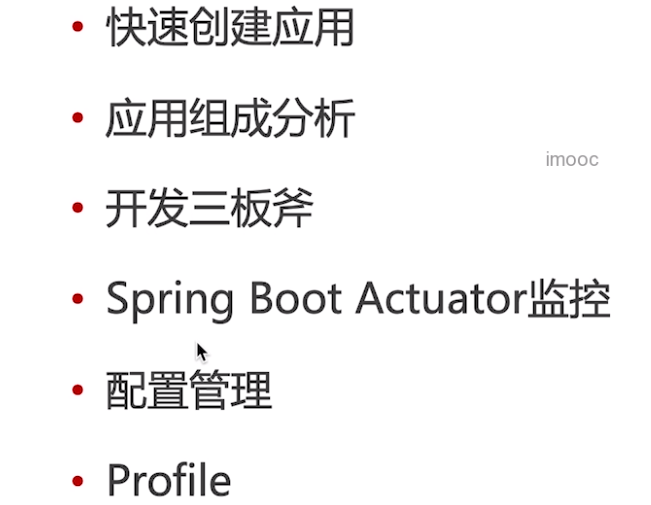

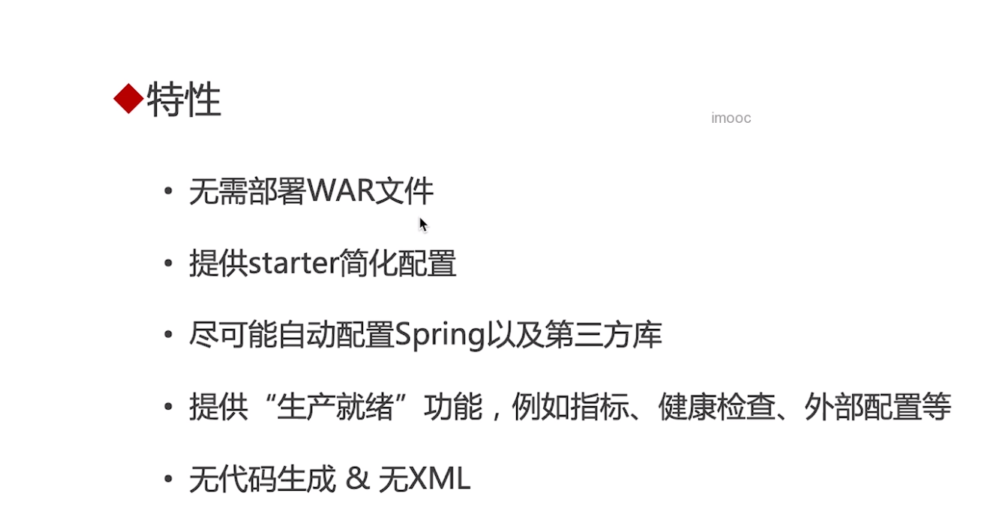

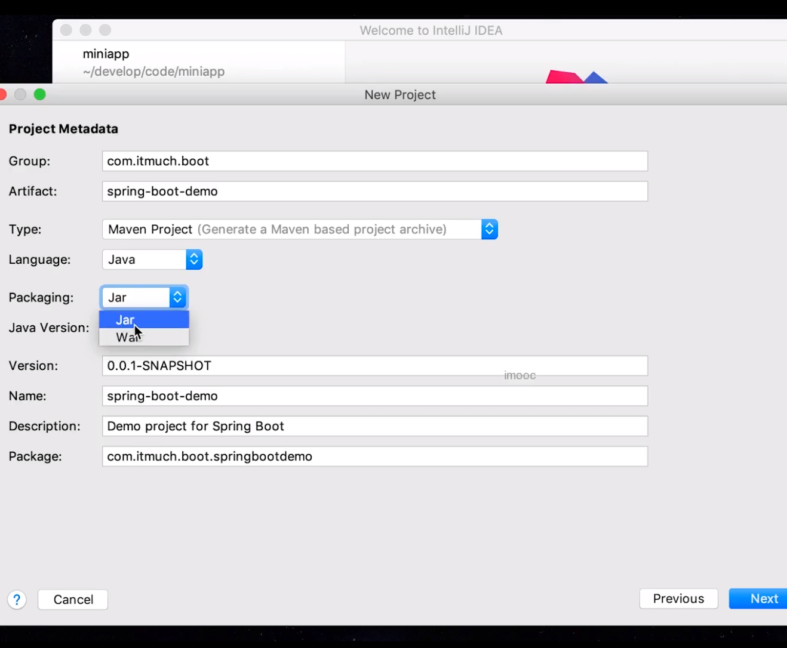

# 加依赖
“dep"+tab

pom 快捷键

# 写注解
# 写配置
# SpringBootActuator 
springboot监控

#  配置管理
springboot17种配置管理
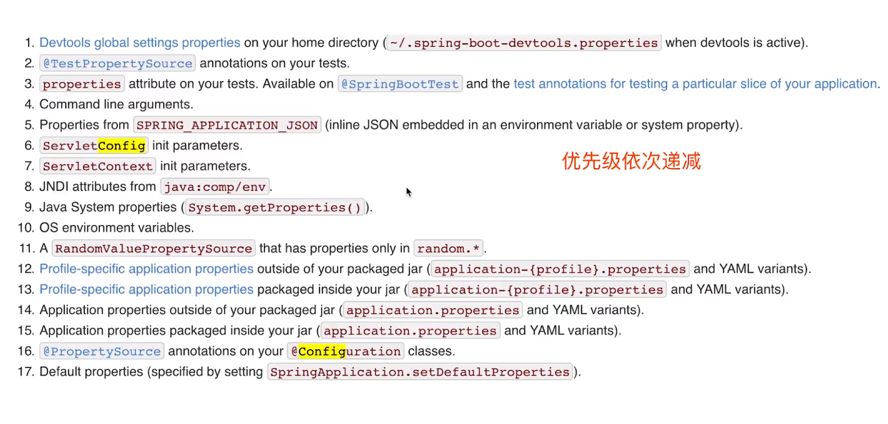


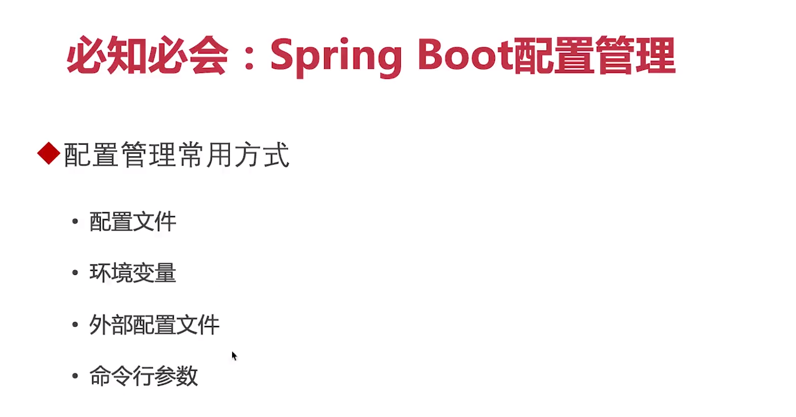

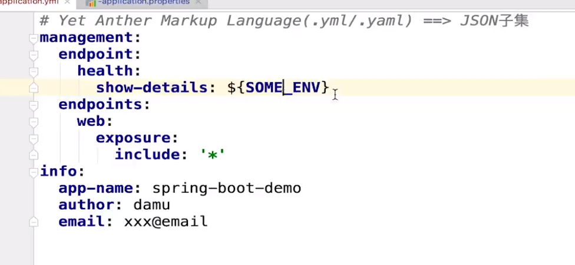


忽略掉单元测试：`mvn clean install -DskipTests`


# 外置配置文件
与jar包同目录，优先级更高

# 命令
java -jar xx.jar --server.port=8081

# profiles
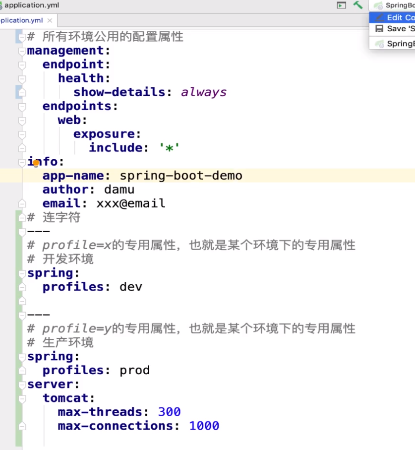

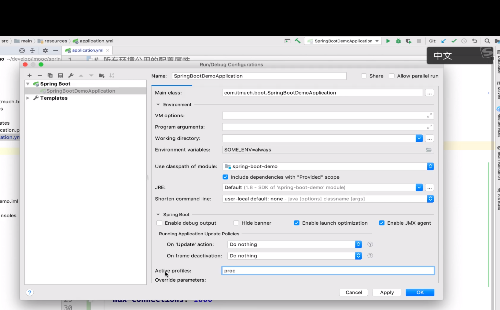

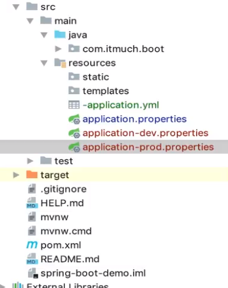

