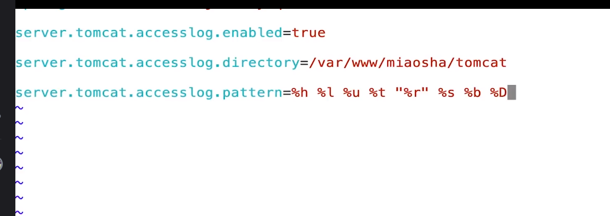

grant all privileges on *.* to root@'%' identified by 'root'


# nginx模块太多

选择openResty版本


# 配置文件
## server节点
```
http {
    #设定mime类型,类型由mime.type文件定义
    include    mime.types;
    default_type  application/octet-stream;
    #设定日志格式
    log_format  main  '$remote_addr - $remote_user [$time_local] "$request" '
                      '$status $body_bytes_sent "$http_referer" '
                      '"$http_user_agent" "$http_x_forwarded_for"';
 
    access_log  logs/access.log  main;
 
    #sendfile 指令指定 nginx 是否调用 sendfile 函数（zero copy 方式）来输出文件，
    #对于普通应用，必须设为 on,
    #如果用来进行下载等应用磁盘IO重负载应用，可设置为 off，
    #以平衡磁盘与网络I/O处理速度，降低系统的uptime.
    sendfile     on;
    #tcp_nopush     on;
 
    #连接超时时间
    #keepalive_timeout  0;
    keepalive_timeout  65;
    tcp_nodelay     on;
 
    #开启gzip压缩
    gzip  on;
    gzip_disable "MSIE [1-6].";
 
    #设定请求缓冲
    client_header_buffer_size    128k;
    large_client_header_buffers  4 128k;
 
 
    #设定虚拟主机配置
    server {
        #侦听80端口
        listen    80;
        #定义使用 www.nginx.cn访问
        server_name  www.nginx.cn;
 
        #定义服务器的默认网站根目录位置
        root html;
 
        #设定本虚拟主机的访问日志
        access_log  logs/nginx.access.log  main;
 
        #默认请求
        location / {
            
            #定义首页索引文件的名称
            index index.php index.html index.htm;   
 
        }
 
        # 定义错误提示页面
        error_page   500 502 503 504 /50x.html;
        location = /50x.html {
        }
 
        #静态文件，nginx自己处理
        location ~ ^/(images|javascript|js|css|flash|media|static)/ {
            
            #过期30天，静态文件不怎么更新，过期可以设大一点，
            #如果频繁更新，则可以设置得小一点。
            expires 30d;
        }
 
        #PHP 脚本请求全部转发到 FastCGI处理. 使用FastCGI默认配置.
        location ~ .php$ {
            fastcgi_pass 127.0.0.1:9000;
            fastcgi_index index.php;
            fastcgi_param  SCRIPT_FILENAME  $document_root$fastcgi_script_name;
            include fastcgi_params;
        }
 
        #禁止访问 .htxxx 文件
            location ~ /.ht {
            deny all;
        }
 
    }
}
```

netstat -an | grep 80

# 配置
worker_processes工作进程
events

server
server_name多域名

mine.type


```
location / {
    root html;
    index index.html index.htm;
}
```

nginx
root
alias

# 动静分离


```
upstream backend_server{
    server ip:port weight=1;#weight权重
    server ip:port weight=1;
}

location / {
    proxy_pass http://backend_server;
    proxy_set_header Host $http_host:$proxy_port;
    proxy_set_header X-Real-IP $remote_addr;
    proxy_set_header X-Forwarded-For $proxy_add_x_forwarded_for;
}

```

# 开启tomcat access log验证



---

# nginx
+ 使用nginx作为web服务器
+ 使用nginx作为动静分离服务器
+ 使用nginx作为反向代理服务器
# OpenResty版本安装
1. 配置`.configure`
2. 编译`make`
3. 安装`make install`
# 常用命令
```
>nginx -c nginx.conf    #启动
>nginx -s reload    #无缝重启
>nginx -s quit    #安全退出服务
>nginx -s stop    #强制关闭
```
# 静态代理
```nginx
http {
    include mine.types;
    default_type application/octet-stream;
    server{
        listen 80;
        server_name localhost;

        location / {
            root /html#路径，注意权限
            index index.html index.htm;
        }
    }
}
```
# 动静分离
```nginx
http {
    include mine.types;
    default_type application/octet-stream;
    server{
        listen 80;
        server_name localhost;

        location /resources/ {
            alise /resources/#注意，这里一定要有个/ 
            index index.html index.htm;
        }
    }
}
```
# 反向代理
```nginx
http {
    include mine.types;
    default_type application/octet-stream;

    upstream servers{
        server ip:port weight=1;#weigth权重
        server ip:port weight=1;#weigth权重
    }

    server{
        listen 80;
        server_name localhost;

        location / {
            proxy_pass http://servers;
            proxy_set_header Host $http_host:$proxy_port;
            proxy_set_header X-Real-IP $remote_addr;
            proxy_set_header X-Forwarded-For $proxy_add_x_forwarded_for;
        }
    }
}
```

# nginx keepalivetime长连接
http1.0协议默认是不支持keepalive的，使用1.1自动设置keepalive，并将header头文件置空
```
upstream servers{
    server ip:port weight=1;
    keepalive 30;
}

location / {
    proxy_http_version 1.1;
    proxy_set_header Connection "";
}
```

netstat -an | grep ip | grep ESTABLISHED
netstat -an | grep ip | grep TIME_WAIT
