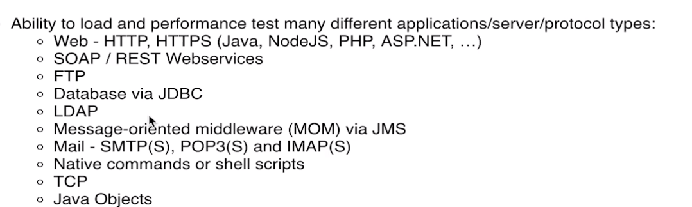
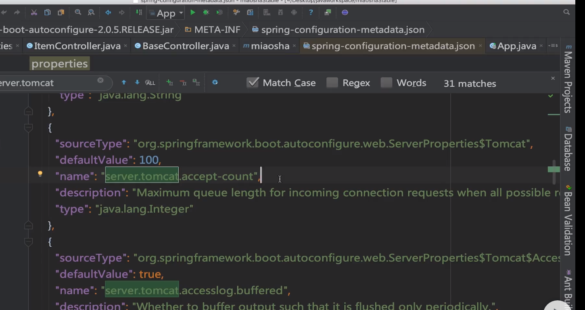
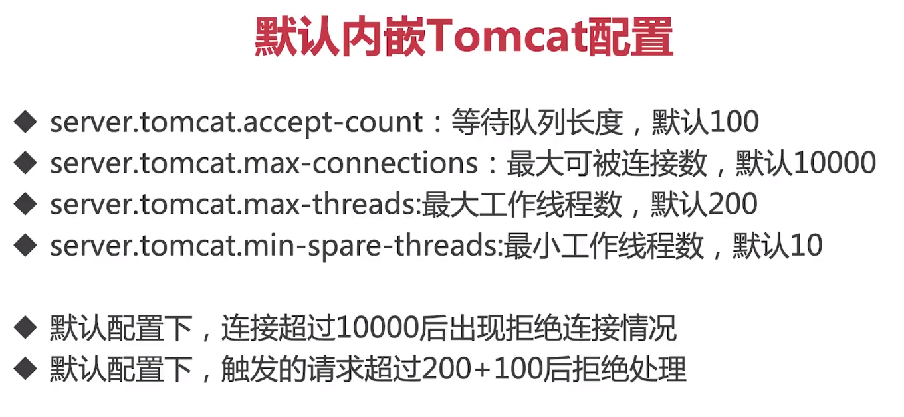
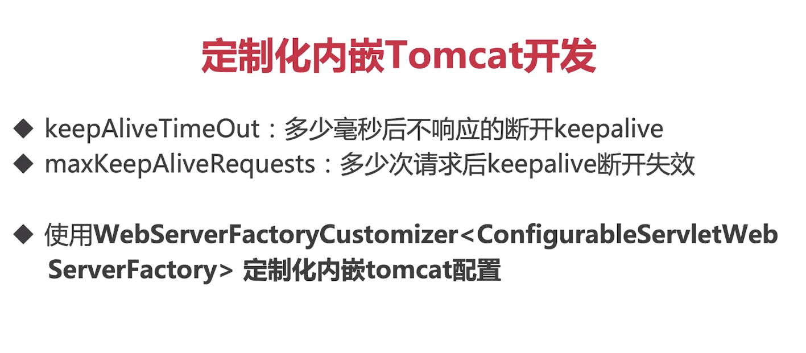
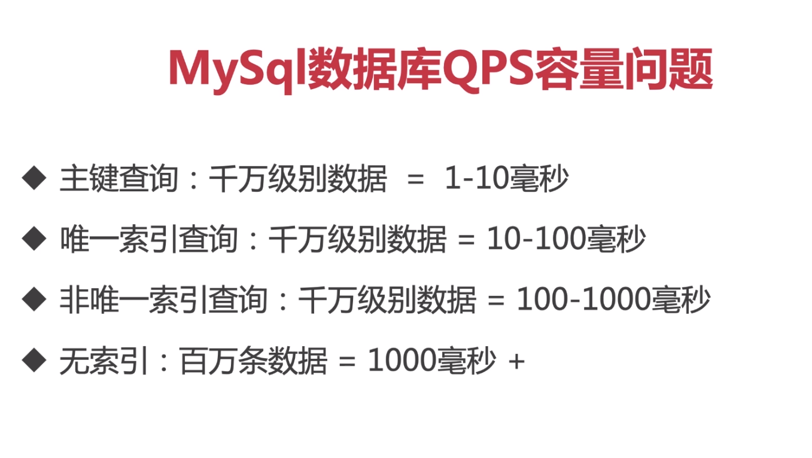

maven打包
上传
外挂配置文件
编写deploy脚本启动


vim deploy.sh
```
nohub java -Xms400m -Xmx400m -XX:NewSize=200 -XX:MaxNewSize=200 -jar jarname.jar --spring.config.addition-location.properties=/../.application.properties
```
chmod -R 777 *
./deploy.sh &


# jmeter性能压测
支持协议


+ 线程组：在jmeter内部启动多个并发的线程
+ Http请求
+ 查看结果树
+ 聚合报告

keepalive：保持长连接

tps:throughput


# 容量问题：server端并发线程数上不去
线程访问多被拒绝

pstree -pid 查看线程数量
pstree -p {pid} | wc -l
top -H

cpu:us用户空间，sy系统空间

load average: 0 0 0最近的1分钟，5分钟,15分钟cpu使用率


springBoot配置
spring-configuration-metadata.json文件下查看各个节点的配置


server.tomcat.accept-count：当我们线程占满之后最大等待队列的大小
server.tomcat.min-spare-threads:最小线程空闲数量
server.tomcat.max-connections:默认接受最大连接数
server.tomcat.max-threads:最大线程数



最佳线程数？


jmeter单机瓶颈

tomcat内嵌容器没有keepAlive

jmeter keepAlive（长连接）
http协议keepalive



容量问题：响应时间变长TPS上不去



mysql聚集索引，buffer缓存

