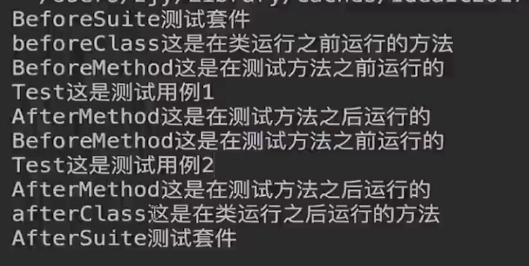

[TOC]

# maven导入
```
<!-- https://mvnrepository.com/artifact/org.testng/testng -->
<dependency>
    <groupId>org.testng</groupId>
    <artifactId>testng</artifactId>
    <version>7.1.0</version>
    <scope>test</scope>
</dependency>
```

# testng VS junit

# TestNG
@Test
@BeforeMethod
@AfterMethod
@BeforeClass
@AfterClass
@BeforeSuite
@AfterSuite



# 套件测试
