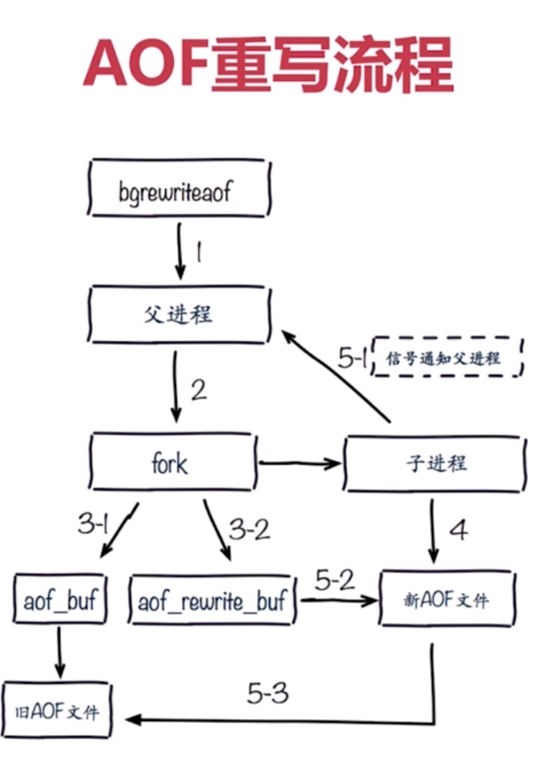
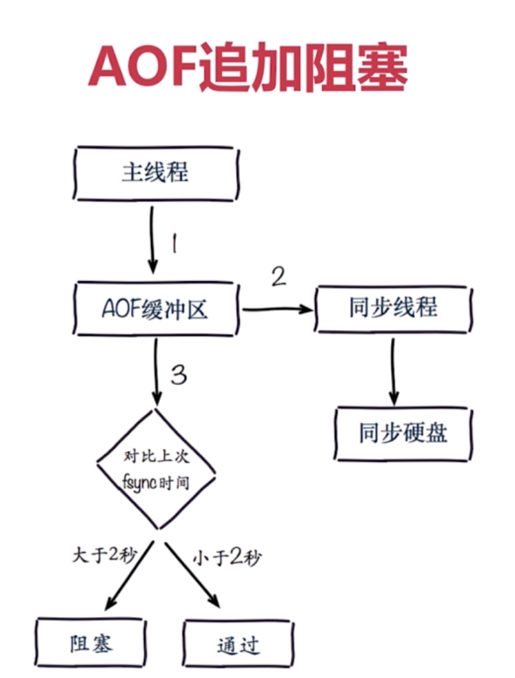

[TOC]

# 概览
Redis 默认不开启。它的出现是为了弥补RDB的不足（数据的不一致性），所以它采用日志的形式来记录每个写操作，并追加到文件中。Redis 重启的会根据日志文件的内容将写指令从前到后执行一次以完成数据的恢复工作。
## 操作粒度
aof：每条操作之后
rdb：快照时间点
# AOF的三种策略
| appendfsync 选项的值 |                                                                      flushAppendOnlyFile 函数的行为                                                                       |          优点          |                缺点                |
| -------------------- | ------------------------------------------------------------------------------------------------------------------------------------------------------------------------- | ---------------------- | ---------------------------------- |
| always               | 将 aof_buf 缓冲区中的所有内容写入并同步到 AOF 文件。                                                                                                                      | 不丢失数据             | IO开销较大，一般的ata盘只有几百TPS |
| everysec             | 将 aof_buf 缓冲区中的所有内容写入到 AOF 文件， 如果上次同步 AOF 文件的时间距离现在超过一秒钟， 那么再次对 AOF 文件进行同步， 并且这个同步操作是由一个线程专门负责执行的。 | 每秒一次fsync丢1秒数据 | 丢1秒数据                          |
| no                   | 将 aof_buf 缓冲区中的所有内容写入到 AOF 文件， 但并不对 AOF 文件进行同步， 何时同步由操作系统来决定。                                                                     | 不用管                 | 不可控                             |
如果用户没有主动为 appendfsync 选项设置值， 那么 appendfsync 选项的默认值为 everysec ， 关于 appendfsync 选项的更多信息， 请参考 Redis 项目附带的示例配置文件 redis.conf 。
##  文件的写入和同步
+ 为了提高文件的写入效率， 在现代操作系统中， 当用户调用 write 函数， 将一些数据写入到文件的时候， 操作系统通常会将写入数据暂时保存在一个内存缓冲区里面， 等到缓冲区的空间被填满、或者超过了指定的时限之后， 才真正地将缓冲区中的数据写入到磁盘里面。
+ 这种做法虽然提高了效率， 但也为写入数据带来了安全问题， 因为如果计算机发生停机， 那么保存在内存缓冲区里面的写入数据将会丢失。
+ 为此， 系统提供了 fsync 和 fdatasync 两个同步函数， 它们可以强制让操作系统立即将缓冲区中的数据写入到硬盘里面， 从而确保写入数据的安全性。
## AOF 持久化的效率和安全性
+ 服务器配置 appendfsync 选项的值直接决定 AOF 持久化功能的效率和安全性。
+ 当 appendfsync 的值为 always 时， 服务器在每个事件循环都要将 aof_buf 缓冲区中的所有内容写入到 AOF 文件， 并且同步 AOF 文件， 所以 always 的效率是 appendfsync 选项三个值当中最慢的一个， 但从安全性来说， always 也是最安全的， 因为即使出现故障停机， AOF 持久化也只会丢失一个事件循环中所产生的命令数据。
+ 当 appendfsync 的值为 everysec 时， 服务器在每个事件循环都要将 aof_buf 缓冲区中的所有内容写入到 AOF 文件， 并且每隔超过一秒就要在子线程中对 AOF 文件进行一次同步： 从效率上来讲， everysec 模式足够快， 并且就算出现故障停机， 数据库也只丢失一秒钟的命令数据。
+ 当 appendfsync 的值为 no 时， 服务器在每个事件循环都要将 aof_buf 缓冲区中的所有内容写入到 AOF 文件， 至于何时对 AOF 文件进行同步， 则由操作系统控制。
+ 因为处于 no 模式下的 flushAppendOnlyFile 调用无须执行同步操作， 所以该模式下的 AOF 文件写入速度总是最快的， 不过因为这种模式会在系统缓存中积累一段时间的写入数据， 所以该模式的单次同步时长通常是三种模式中时间最长的： 从平摊操作的角度来看， no 模式和 everysec 模式的效率类似， 当出现故障停机时， 使用 no 模式的服务器将丢失上次同步 AOF 文件之后的所有写命令数据。
# AOF 重写机制
+ AOF持久化是通过保存被执行的写命令来记录数据库状态的，所以AOF文件的大小随着时间的流逝一定会越来越大；影响包括但不限于：对于Redis服务器，计算机的存储压力；AOF还原出数据库状态的时间增加；
+ 为了解决AOF文件体积膨胀的问题，Redis提供了AOF重写功能：Redis服务器可以创建一个新的AOF文件来替代现有的AOF文件，新旧两个文件所保存的数据库状态是相同的，但是新的AOF文件不会包含任何浪费空间的冗余命令，通常体积会较旧AOF文件小很多。
# AOF重写实现两种方式
1. bgrewriteaof命令
2. AOF重写配置
## bgrewriteaof命令

AOF重写是将redis内存中的数据进行回朔并写入aof文件
# AOF重写配置
配置
auto-aof-rewrite-min-size AOF文件重写需要的尺寸
auto-aof-rewrite-percentage AOF文件增长率
统计
aof_current_size AOF当前尺寸（单位：字节）
aof_base_size AOF上次启动和重写的尺寸（单位：字节）
自动触发时机
aof_current_size>auto-aof-rewrite-min-size
aof_current_size-aof_base_size/aof_base_size>auto-aof-rewrite-percentage



# AOF配置
```
appendonly yes    #使用aof所有功能
appendfilename "appendonly-${port}.aof"    #设置aof名称
appendfsync everysec    #aof同步策略
dir /bigdiskpath    #保存rdb、log、aof的目录
no-appendfsync-on-rewrite yes    #在aof重写的时候是否要做一个aof的判断操作，yes不做操作，aof重写非常消耗性能
auto-aof-rewrite-percentage 100
auto-aof-rewrite-min-size 64mb

aof-load-truncated yes
```

# 总结
+ AOF重写的目的是为了解决AOF文件体积膨胀的问题，使用更小的体积来保存数据库状态，整个重写过程基本上不影响Redis主进程处理命令请求；
+ AOF重写其实是一个有歧义的名字，实际上重写工作是针对数据库的当前状态来进行的，重写过程中不会读写、也不适用原来的AOF文件；
+ AOF可以由用户手动触发，也可以由服务器自动触发。

# 实战
```
redis> config set appendonly yes
redis> bgrewriteaof    #手动触发aof
```
config配置，与直接更改config差异？

# RDB与AOF对比
|    命令    |  RDB   |     AOF      |
| ---------- | ------ | ------------ |
| 启动优先级 | 低     | 高           |
| 体积       | 小     | 大           |
| 恢复速度   | 快     | 慢           |
| 数据安全性 | 丢数据 | 根据策略决定 |
| 轻重       | 重     | 轻           |

# RDB最佳策略
关闭rdb
集中管理
主从，从开？

# AOF最佳策略
"开"：缓存和存储
AOF重写集中管理（分配内存的70,80给redis，剩余的保障开启fork不会出现异常）
选择everysec

# 最佳策略
小分片
缓存或者存储
监控（硬盘、内存、负载、网络）
足够的内存

# 开发运维常见问题
1.fork操作
2.进程外开销
3.AOF追加阻塞
4.单机多实例部署

# fork操作
1.同步操作
2.与内存量息息相关：内存越大，耗时越长（与机器类型有关）
3.info:latest_fork_usec 查看持久化时间

# 改善fork
1.优化使用物理机或者高效支持fork操作的虚拟化技术
2.控制Redis实例最大可用内存：maxmemory
3.合理配置Linux内存分配策略：vm.overcommit_memory=1
4.降低fork频率：例如放宽AOF重写自动触发时机，不必要的全量复制

# 子进程开销和优化
1.cpu
开销：rdb和aof文件生成，属于cpu密集型
优化：不做cpu绑定，不和cpu密集型部署
2.内存
开销：fork内存开销，copy-on-write。
优化：echo never > /sys/kernel/mm/transparent_hugepage/enabled
3.硬盘
开销：aof和rdb文件写入，可以结合iostat，iotop分析

# 硬盘优化
1.不要和高硬盘负载服务部署一起：存储服务、消息队列等
2.no-appendfsync-on-rewrite=yes
3.根据写入量决定磁盘类型：例如ssd
4.单机多实例持久化文件目录可以考虑分盘

# aof追加阻塞


# aof阻塞定位
Redis日志：
Asynchronous AOF fsync is taking too long(disk is busy?).
Writing the AOF buffer without waiting for fsync to complete,this may slow down Redis.

`info persistence`查看持久化信息,aof次数


