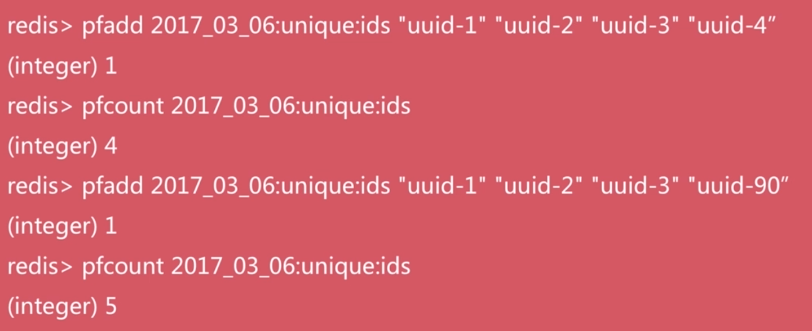
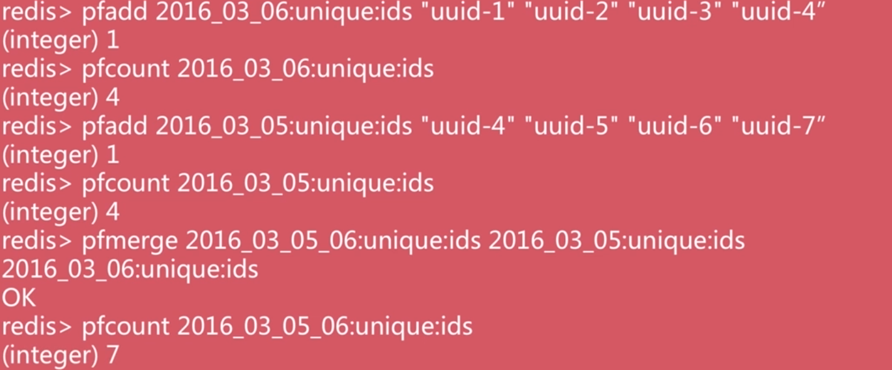
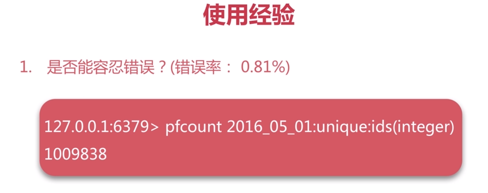

# hyperloglog
基于hyperloglog算法：用极小的空间完成独立数量统计
本质还是字符串
```
type hyperloglog_key
string
```
pfadd key elment[element...] #向hyperloglog添加元素
pfcount key [key...] #计算hyperloglog的独立总数
pfmerge destkey sourcekey[sourcekey...] #合并多个hyperloglog

Demo




使用经验

