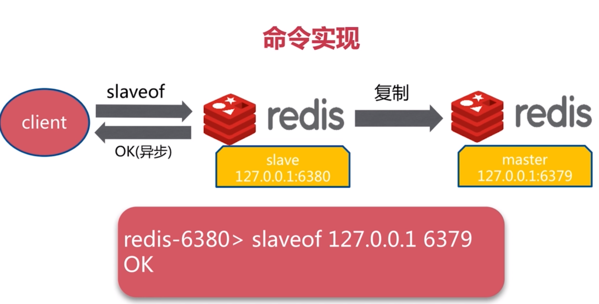
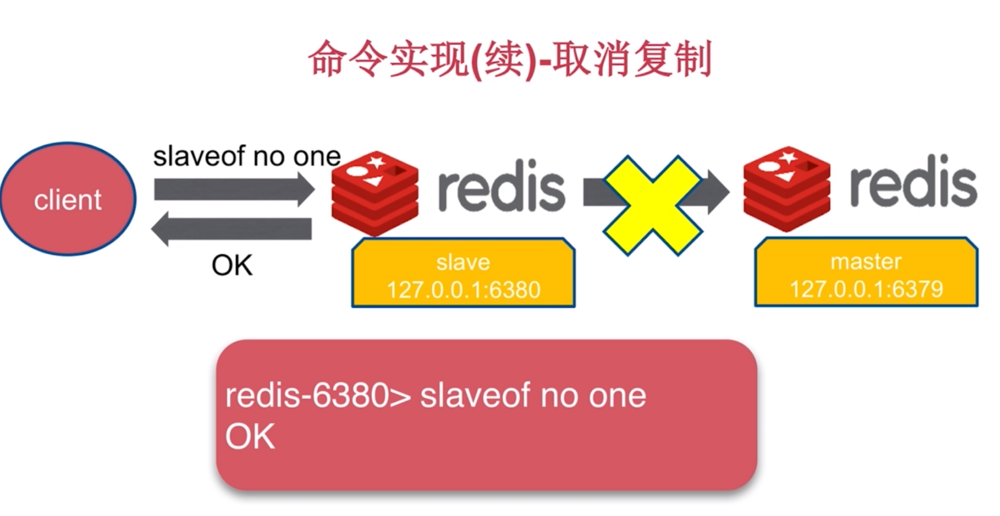
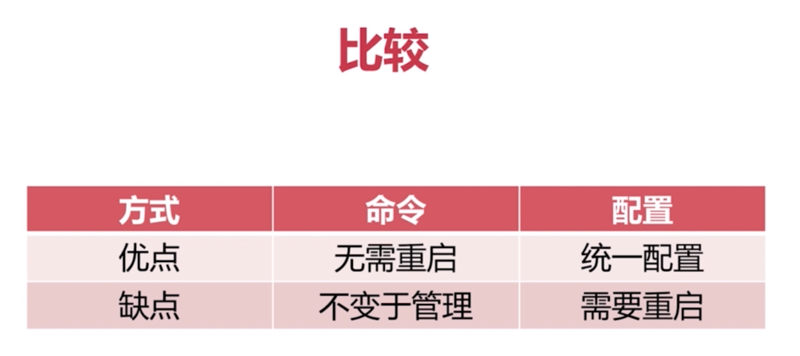
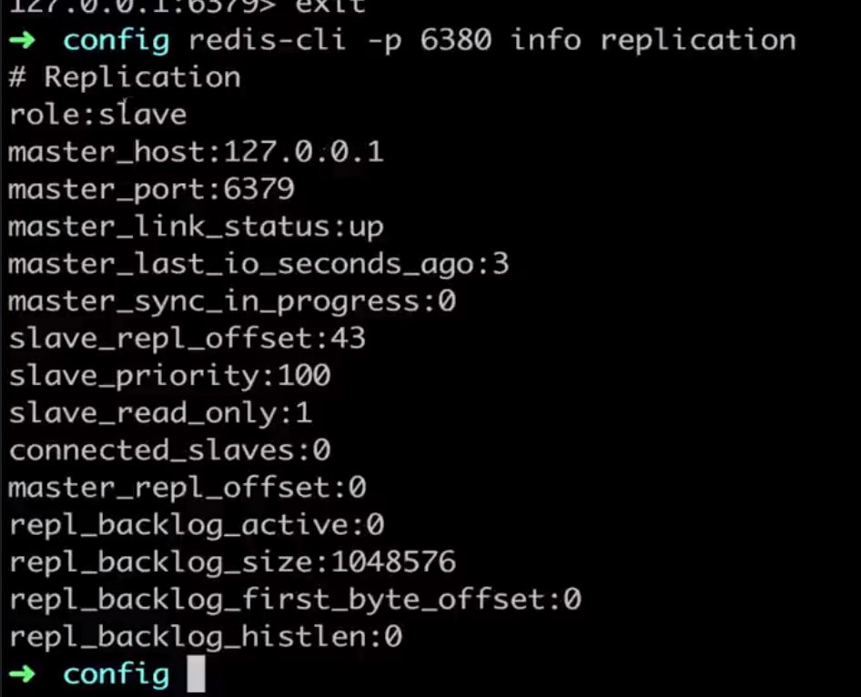
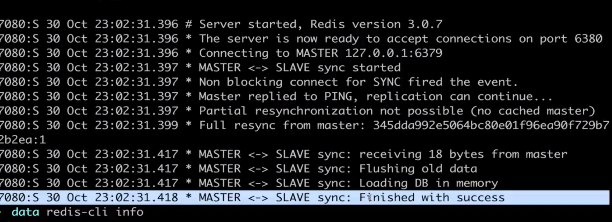
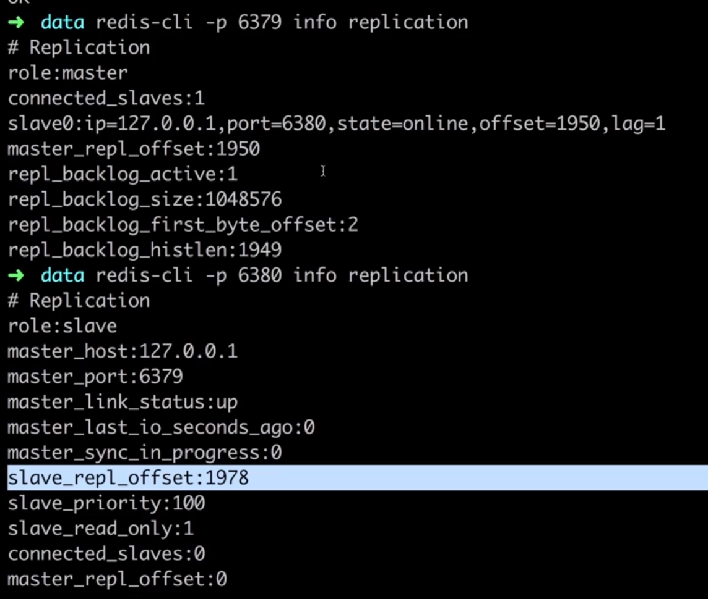
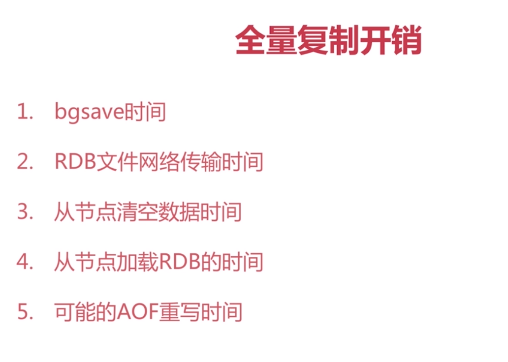
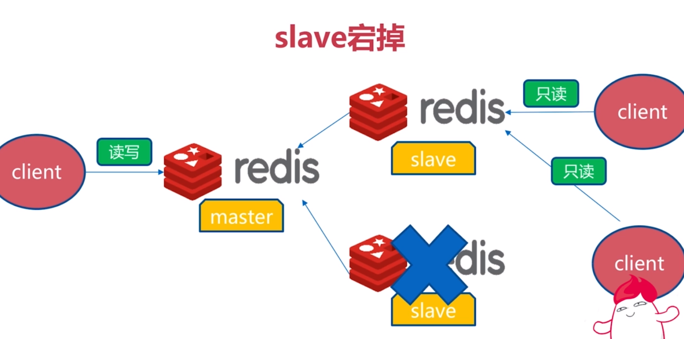
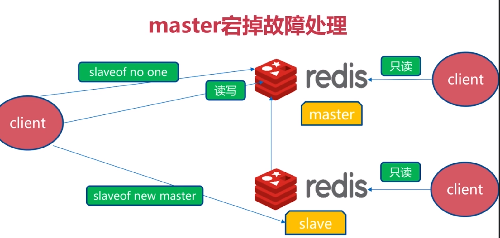

[TOC]

# Redis复制的原理与优化
什么是主从复制
复制的配置
全量复制和部分复制
故障处理
开发运维常见问题

# 单机有什么问题？
机器故障
容量瓶颈
QPS瓶颈

# 主从复制作用
数据副本
扩展读性能

# 简单总结
1.一个master可以有多个slave
2.一个slave只能有一个master
3.数据流向是单向的，master到slave

# 实现主从复制两种实现方式
1.slaveof 命令
2.配置

# 命令实现
主从不应该在一台机子上，这么没有任何意义

上图仅展示实现，复制命令是一个异步命令

注意：从节点在copy主节点数据之前，会将从节点自身数据清除掉

修改配置：
slaveof ip port
slave-read-only yes    #我们希望从节点只做读的操作，不希望写入，如果写入会造成主从数据不一致

# 主从
是不是只有一个主，多个从这种情况

slaveof 127.0.0.1 6379

info replication

redis:run_id

flushall

# runid和复制偏移量
重启之后runid会更换
runid是一个标识

主节点偏移量

从节点偏移量

如果主从节点偏移量不同可能为：
网络，阻塞，缓存区出现问题

# 全量复制

# 全量复制开销

redis2.8之前都是全量复制

# 部分复制
如果发生了抖动

# 故障处理

# 自动故障转移

# 主从结构——故障转移

## slave宕掉

## master宕掉
