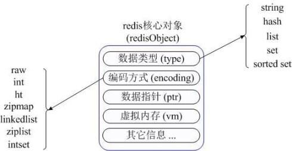

[TOC]

# redisObject


```c
struct redisObject
{
    数据类型（type）[string,hash,list,set,sorted set];
    编码方式（encoding）[raw,int,ziplist,linkedlist,hashmap,intset];
    数据指针（ptr）;
    虚拟内存（vm）;
    其他信息;
};
```
首先Redis内部使用一个redisObject对象来表示所有的key和value，redisObject最主要的信息如上图所示：type代表一个value对象具体是何种数据类型，encoding是不同数据类型在redis内部的存储方式，比如：type=string代表value存储的是一个普通字符串，那么对应的encoding可以是raw或者是int，如果是int则代表实际redis内部是按数值型类存储和表示这个字符串的，当然前提是这个字符串本身可以用数值表示，比如:"123" "456"这样的字符串。

这里需要特殊说明一下vm字段，只有打开了Redis的虚拟内存功能，此字段才会真正的分配内存，该功能默认是关闭状态的。通过上图我们可以发现Redis使用redisObject来表示所有的key/value数据是比较浪费内存的，当然这些内存管理成本的付出主要也是为了给Redis不同数据类型提供一个统一的管理接口，实际作者也提供了多种方法帮助我们尽量节省内存使用。

# none
# string
## 简介
string 是 redis 最基本的类型，你可以理解成与 Memcached 一模一样的类型，一个 key 对应一个 value。value其实不仅是String，也可以是数字。string 类型是二进制安全的。意思是 redis 的 string 可以包含任何数据。比如jpg图片或者序列化的对象。string 类型是 Redis 最基本的数据类型，string 类型的值最大能存储 512MB。
## 应用场景
1. String是最常用的一种数据类型，普通的key/ value 存储都可以归为此类，即可以完全实现目前 Memcached 的功能，并且效率更高。还可以享受Redis的定时持久化，操作日志及 Replication等功能。
2. 常规key-value缓存应用。常规计数: 微博数, 粉丝数。 实现方式：String在redis内部存储默认就是一个字符串，被redisObject所引用，当遇到incr,decr等操作时会转成数值型进行计算，此时redisObject的encoding字段为int。
## 难点
位运算

# hash
哈希键值结构：key->[field,value]
特点
map的map
small的redis
field不能相同，value可以相同
hash分为两种(encoding)：hashtable、ziplist，如果量达到一定就会使用ziplist压缩节省内存
hash缺点：不能对key设置过期时间

# list
RPUSH+RPOP=Stack
LPUSH+RPOP=Queue
LPUSH+LTRIM=Capped Collection
LPUSH+BRPOP=Message Queue
LPUSH+BRPOP=MQ

# set
SADD =Tagging
SPOP/SRANDMEMBER=Random item
SADD+SINTER=Social Graph
特点：
无序、无重复、集合间操作（交集、并集、差集）

注意：
集合实战：
给用户添加标签
```
sadd user:1:tags tag1 tag2 tag3
```
给用户添加标签
```
sadd tag1:users user1 user2
```

# zset
集合vs有序集合
集合：无重复元素、无序、element
有序集合：无重复元素、有序、element+score

基本操作：zadd,zrem,zcard,zincrby,zscore
范围操作：zrange,zrangebyscore,zcount,zremrangebyrank
集合操作：zunionstore,zinterstore
