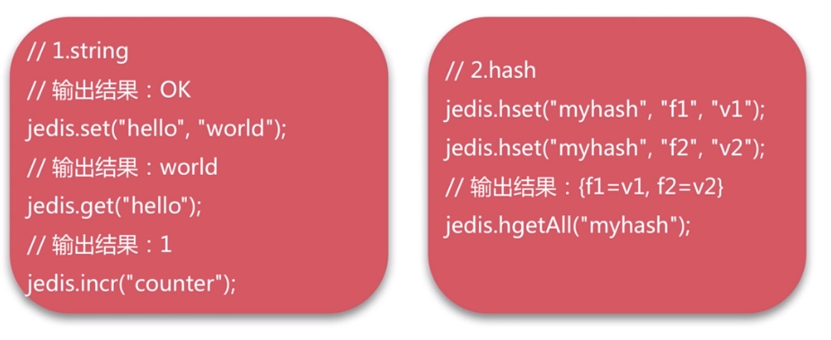
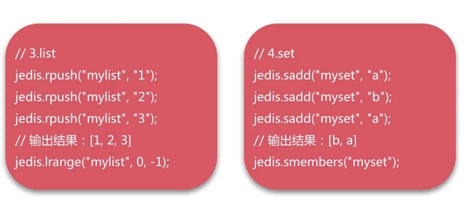
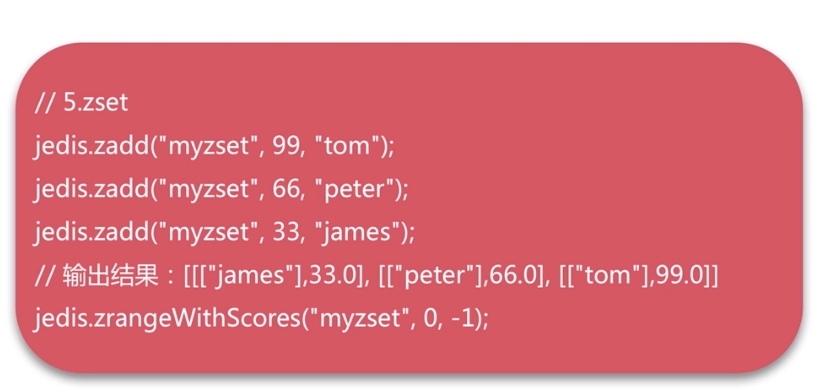
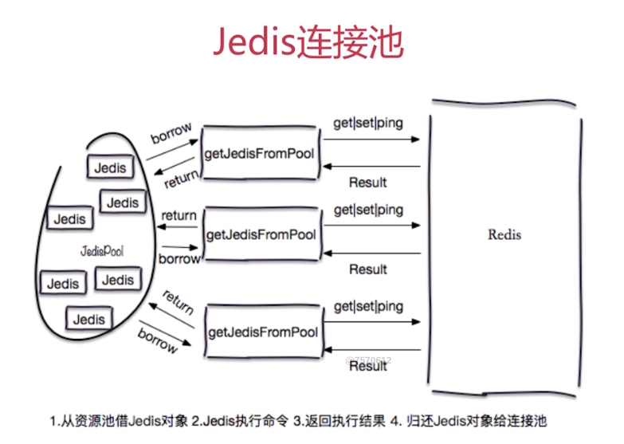
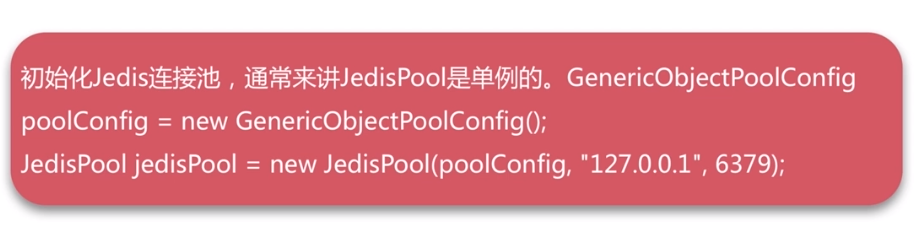
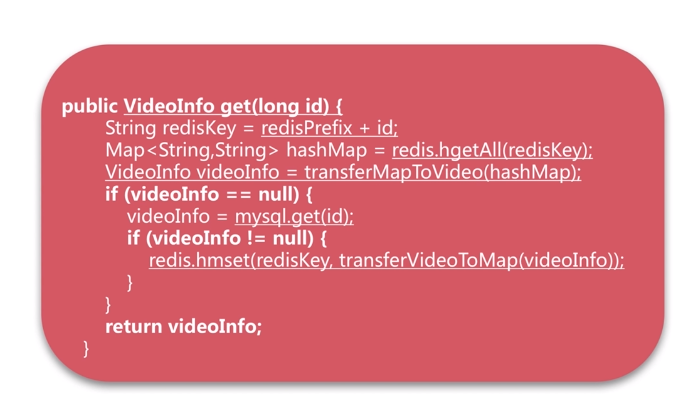
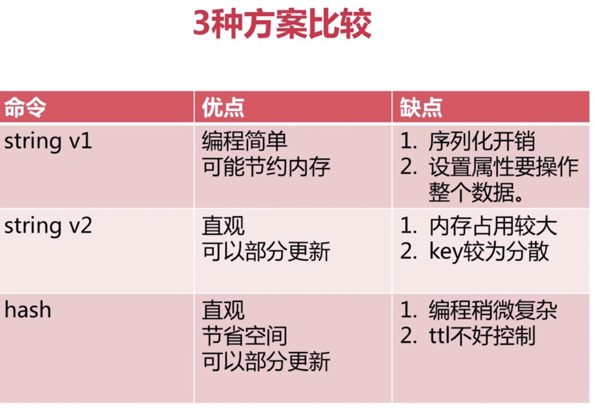

[TOC]

# redis 关键字
+ 高性能Key-Value服务器
+ 多种数据结构
+ ops官方说可以达到10w
+ 阿里云Redis开发规范
+ 完全内存结构

# 数据结构与内部编码


# redisObject
```c
struct redisObject
{
    数据类型（type）[string,hash,list,set,sorted set];
    编码方式（encoding）[raw,int,ziplist,linkedlist,hashmap,intset];
    数据指针（ptr）;
    虚拟内存（vm）;
    其他信息;
};
```
# 单线程为什么这么快？
1. 纯内存
2. 非阻塞IO
3. 避免了线程切换和竞态消耗

# 速度快根本原因
|  类型  | 每秒读写次数 | 随机读写延迟 | 访问宽带 |
| ------ | ------------ | ------------ | -------- |
| Memory | 千万         | 80ns         | 5GB      |
| SSD    | 35000        | 0.1-0.2ms    | 100-300M |
| HDD    | 100左右      | 10ms         | 100M左右     |
# 使用单线程要注意：
1. 一次只运行一条命令
2. 拒绝长（慢）命令：keys,flushall,flushdb,slow lua script,mutil/exec,operate big value(collection)
3. 其实不是单线程:fysnc file descriptor,close file descriptor
# redis应用场景
+ 缓存系统
+ 计数器
+ 消息队列系统
+ 排行榜
+ 社交网络
+ 实时系统
+ 分布式锁
# redis启动
## 最简启动（动态参数启动）
redis-server [--port port]
ps -ef|grep redis
netstat -antpl|grep redis
redis-cli -h ip -p port ping
## 配置文件启动
redis-server configPath
# redis常用配置
daemonize是否是守护线程no|yes
port对外端口（默认6379）
logfile系统日志
dir工作目录
# redis command
+ redis-server
+ redis-cli -h host -p port -a password
+ redis-benchmark
+ redis-check-aof
+ redis-check-dump
+ redis-sentinel
+ config get * #获取当前redis全部配置
+ ping
+ dbsize #计算key的总数，不会遍历全部key，是读取redis内置计数器【时间复杂度O(1)】


HASH
哈希键值结构：key->[field,value]
特点
map的map
small的redis
field不能相同，value可以相同
hash分为两种：hashtable、ziplist，如果量达到一定就会使用ziplist压缩节省内存
hash缺点：不能对key设置过期时间

## LIST
RPUSH+RPOP=Stack
LPUSH+RPOP=Queue
LPUSH+LTRIM=Capped Collection
LPUSH+BRPOP=Message Queue
LPUSH+BRPOP=MQ

# SET
## TIPS
SADD =Tagging
SPOP/SRANDMEMBER=Random item
SADD+SINTER=Social Graph
特点：
无序、无重复、集合间操作（交集、并集、差集）

注意：
集合实战：
给用户添加标签
```
sadd user:1:tags tag1 tag2 tag3
```
给用户添加标签
```
sadd tag1:users user1 user2
```

# ZSET
集合vs有序集合
集合：无重复元素、无序、element
有序集合：无重复元素、有序、element+score

基本操作：zadd,zrem,zcard,zincrby,zscore
范围操作：zrange,zrangebyscore,zcount,zremrangebyrank
集合操作：zunionstore,zinterstore

---

Jedis(String host,int port,int connectionTimeout,int soTimeout)
host：Redis节点的所在机器的ip
port：Redis节点的端口
connectTimeout：客户端连接超时
soTimeout：客户端读写超时










方案对比
直连
优点：

+ 简单方便
+ 适用于少量长期连接的场景
缺点：

+ 存在每次新建/关闭TCP开销
+ 资源无法控制，存在连接泄露的可能
+ Jedis对象线程不安全

连接池
优点：

+ Jedis预先生成，降低开销使用
+ 连接池的形式保护和控制资源的使用

缺点：

+ 相对于直连，使用相对麻烦，尤其在资源的管理上需要很多参数来保证，一旦规划不合理也会出现问题。

jedis new线程不安全




# redis配置优化


---

实战
记录网站每个用户个人主页的访问量？
hincrby user:1:info pageview count
缓存视频的基本信息（数据源在mysql中）伪代码
ount>0，从左到

String VS Hash
api相似




