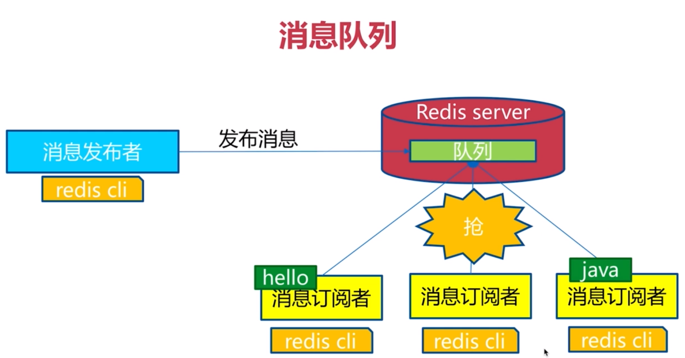

# 发布订阅模式
角色：
发布者（publisher）
订阅者（subscriber）
频道（channel）

redis无法消息堆积（获取历史消息）

API
publish
subscribe
unsubscribe
其他

publish channel message
```
redis> publish sohu:tv "hello world"
(integer) 3 #订阅者个数
redis> publish sohu:auto "taxi"
(integer)
```

subscribe [channel] #一个或多个

unsubcribe [channel]

psubscribe [pattern...] #按照模式订阅
punsubscribe [pattern...] #退订指定的模式
pubsub channels #列出至少有一个订阅者的频道
pubsub numsub [channel...] #列出给定频道的订阅者数量
pubsub numpat #列出被订阅模式的数量



# 消息队列 与 发布订阅