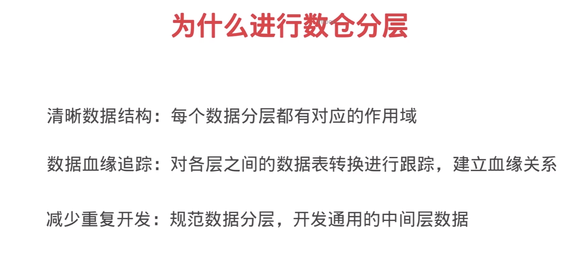
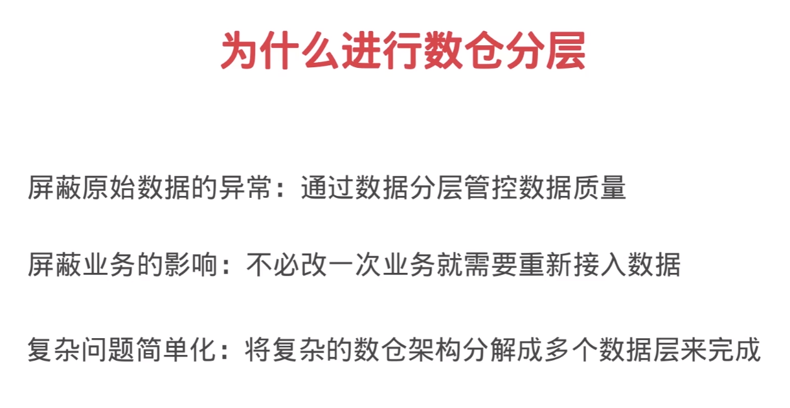
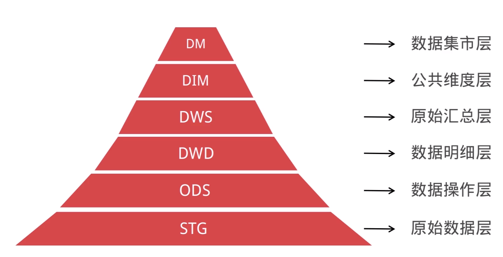
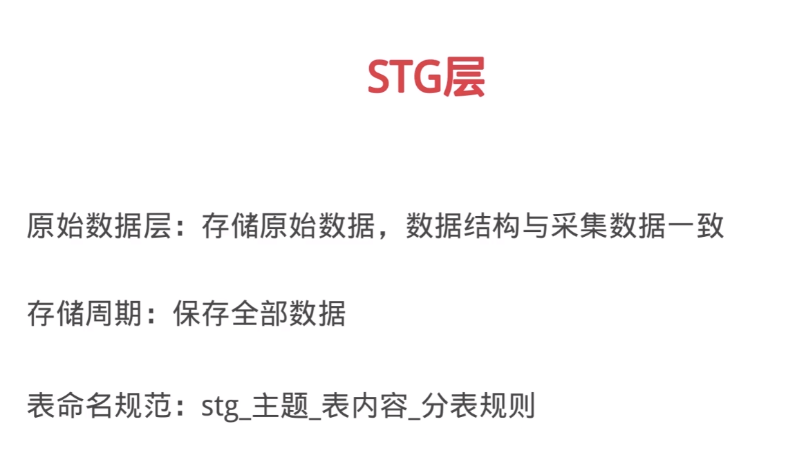
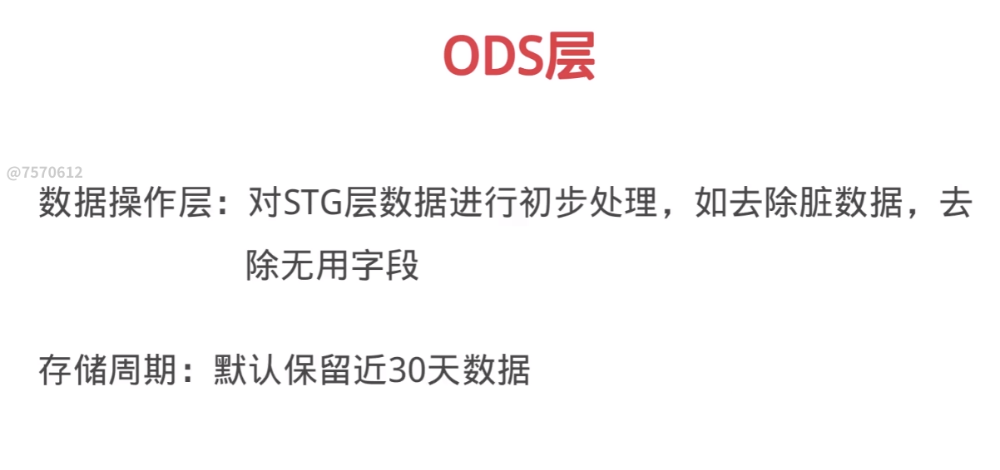
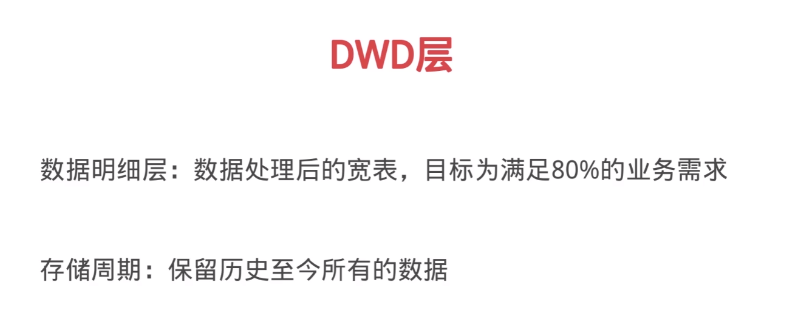
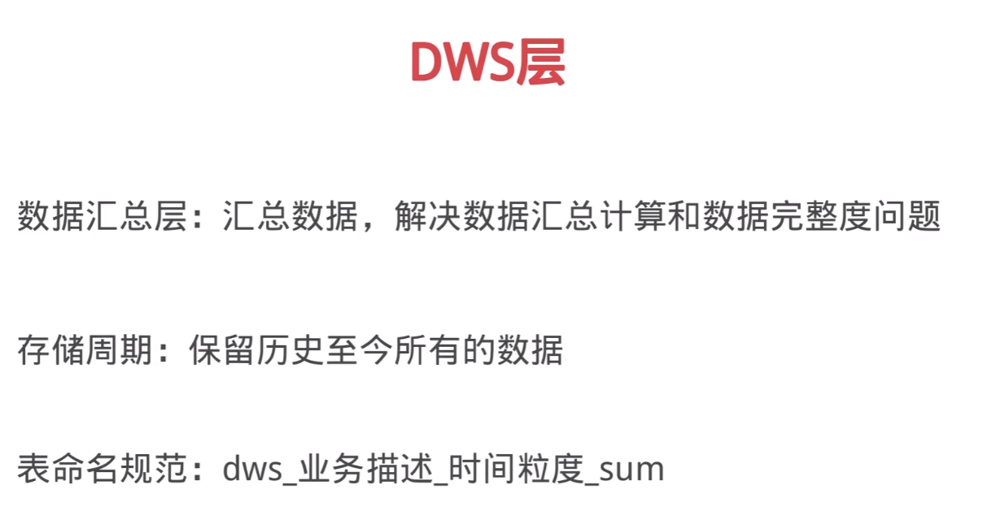
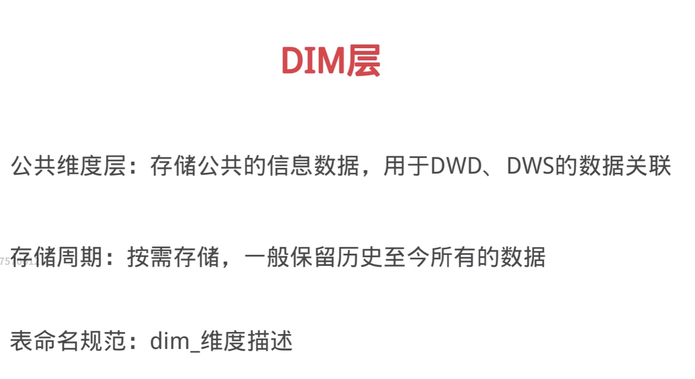
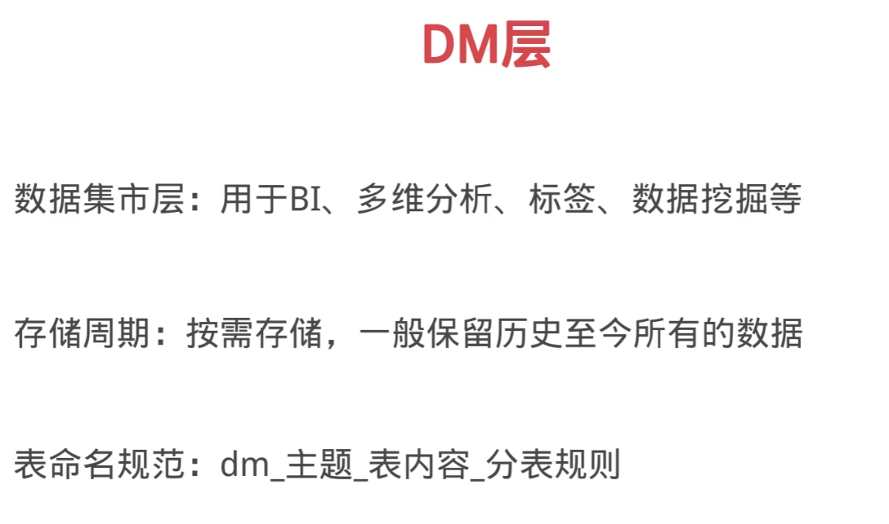

[TOC]

# 数据仓库
数据仓库是将多个数据源的数据经过ETL处理之后，按照一定的主题集成起来提供决策支持和联机分析应用的结构化数据环境

# ETL
+ Extract（抽取）
+ Transform（转换）
+ Load（加载）

数据库是面向事务的设计
数据仓库是面向主题设计的
数据库一般存储在线交易数据
数据仓库存储的一般是历史数据

数据库设计是避免冗余，采用三范式的规则来设计，数据仓库在设计是有意引入冗余，采用反范式的方式来设计

# OLTP vs OLAP
联机事务处理OLTP是传统的关系型数据库的主要应用，主要是基本的、日常的实物处理，例如银行交易，毫秒级
联机分析处理OLAP是数据仓库系统的主要应用，支持复杂的分析操作，侧重决策支持，并且提供直观易懂的查询结果，秒级

# 为什么创建数据仓库
各个业务数据存在不一致，数据关系混乱
业务系统一般针对于OLTP，而数据仓库可以实现OLAP分析
数据仓库是多源的复杂环境，可以对多个业务的数据进行统一分析

# 数据仓库建设目标
集成多源数据，数据来源和去向可追溯，梳理血缘关系
减少重复开发，保存通用型中间数据，避免重复计算
屏蔽底层业务逻辑，对外提供一致的、结构清晰的数据

# 如何实现
实现通用型数据ETL工具
根据业务建立合理的数据分层模型

