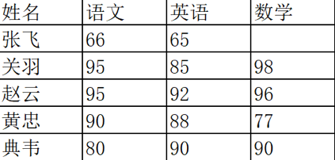
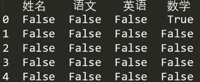
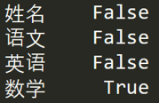

[TOC]

在数据分析工作中，Pandas 的使用频率是很高的，一方面是因为 Pandas 提供的基础数据结构 DataFrame 与 json 的契合度很高，转换起来就很方便。另一方面，如果我们日常的数据清理工作不是很复杂的话，你通常用几句 Pandas 代码就可以对数据进行规整。Pandas 可以说是基于 NumPy 构建的含有更高级数据结构和分析能力的工具包。在 NumPy 中数据结构是围绕 ndarray 展开的，那么在 Pandas 中的核心数据结构是什么呢？

下面主要给你讲下 Series 和 DataFrame 这两个核心数据结构，他们分别代表着一维的序列和二维的表结构。基于这两种数据结构，Pandas 可以对数据进行导入、清洗、处理、统计和输出。

# 数据结构：Series 和 DataFrame
Series 是个定长的字典序列。说是定长是因为在存储的时候，相当于两个 ndarray，这也是和字典结构最大的不同。因为在字典的结构里，元素的个数是不固定的。

Series 有两个基本属性：index 和 values。在 Series 结构中，index 默认是 0,1,2,……递增的整数序列，当然我们也可以自己来指定索引，比如 index=[‘a’, ‘b’, ‘c’, ‘d’]。

```python
import pandas as pd
from pandas import Series, DataFrame
x1 = Series([1,2,3,4])
x2 = Series(data=[1,2,3,4], index=['a', 'b', 'c', 'd'])
print x1
print x2

0    1
1    2
2    3
3    4
dtype: int64
a    1
b    2
c    3
d    4
dtype: int64
```

这个例子中，x1 中的 index 采用的是默认值，x2 中 index 进行了指定。我们也可以采用字典的方式来创建 Series，比如：
```python
d = {'a':1, 'b':2, 'c':3, 'd':4}
x3 = Series(d)
print x3

a    1
b    2
c    3
d    4
dtype: int64
```
DataFrame 类型数据结构类似数据库表。

它包括了行索引和列索引，我们可以将 DataFrame 看成是由相同索引的 Series 组成的字典类型。

我们虚构一个王者荣耀考试的场景，想要输出几位英雄的考试成绩：
```python
import pandas as pd
from pandas import Series, DataFrame
data = {'Chinese': [66, 95, 93, 90,80],'English': [65, 85, 92, 88, 90],'Math': [30, 98, 96, 77, 90]}
df1= DataFrame(data)
df2 = DataFrame(data, index=['ZhangFei', 'GuanYu', 'ZhaoYun', 'HuangZhong', 'DianWei'], columns=['English', 'Math', 'Chinese'])
print df1
print df2
```

在后面的案例中，我一般会用 df, df1, df2 这些作为 DataFrame 数据类型的变量名，我们以例子中的 df2 为例，列索引是[‘English’, ‘Math’, ‘Chinese’]，行索引是[‘ZhangFei’, ‘GuanYu’, ‘ZhaoYun’, ‘HuangZhong’, ‘DianWei’]，所以 df2 的输出是：
```python
            English  Math  Chinese
ZhangFei         65    30       66
GuanYu           85    98       95
ZhaoYun          92    96       93
HuangZhong       88    77       90
DianWei          90    90       80
```

# 数据导入和输出

Pandas 允许直接从 xlsx，csv 等文件中导入数据，也可以输出到 xlsx, csv 等文件，非常方便。
```python
import pandas as pd
from pandas import Series, DataFrame
score = DataFrame(pd.read_excel('data.xlsx'))
score.to_excel('data1.xlsx')
print score
```

需要说明的是，在运行的过程可能会存在缺少 xlrd 和 openpyxl 包的情况，到时候如果缺少了，可以在命令行模式下使用“pip install”命令来进行安装。

# 数据清洗
例子
```python
data = {'Chinese': [66, 95, 93, 90,80],'English': [65, 85, 92, 88, 90],'Math': [30, 98, 96, 77, 90]}
df2 = DataFrame(data, index=['ZhangFei', 'GuanYu', 'ZhaoYun', 'HuangZhong', 'DianWei'], columns=['English', 'Math', 'Chinese'])
```

## 删除DataFrame中不必要的行或列
Pandas 提供了一个便捷的方法 drop() 函数来删除我们不想要的列或行。
```python
df2 = df2.drop(columns=['Chinese'])
df2 = df2.drop(index=['ZhangFei'])
```

## 重命名列名columns
如果你想对 DataFrame 中的 columns 进行重命名，可以直接使用 rename(columns=new_names, inplace=True) 函数，比如我把列名 Chinese 改成 YuWen，English 改成 YingYu。
```python
df2.rename(columns={'Chinese': 'YuWen', 'English': 'Yingyu'}, inplace = True)
```

## 去重复的值
```python
df = df.drop_duplicates() #去除重复行
```

## 格式问题
更改数据格式
```python
df2['Chinese'].astype('str') 
df2['Chinese'].astype(np.int64) 
```
数据间的空格
有时候我们先把格式转成了 str 类型，是为了方便对数据进行操作，这时想要删除数据间的空格，我们就可以使用 strip 函数：
```python
#删除左右两边空格
df2['Chinese']=df2['Chinese'].map(str.strip)
#删除左边空格
df2['Chinese']=df2['Chinese'].map(str.lstrip)
#删除右边空格
df2['Chinese']=df2['Chinese'].map(str.rstrip)
```
如果数据里有某个特殊的符号，我们想要删除怎么办？同样可以使用 strip 函数，比如 Chinese 字段里有美元符号，我们想把这个删掉，可以这么写：
```python
df2['Chinese']=df2['Chinese'].str.strip('$')
```
大小写转换
```python
#全部大写
df2.columns = df2.columns.str.upper()
#全部小写
df2.columns = df2.columns.str.lower()
#首字母大写
df2.columns = df2.columns.str.title()
```
查找空值
数据量大的情况下，有些字段存在空值 NaN 的可能，这时就需要使用 Pandas 中的 isnull 函数进行查找。比如，我们输入一个数据表如下：

如果我们想看下哪个地方存在空值 NaN，可以针对数据表 df 进行 df.isnull()，结果如下：

如果我想知道哪列存在空值，可以使用 df.isnull().any()，结果如下：


